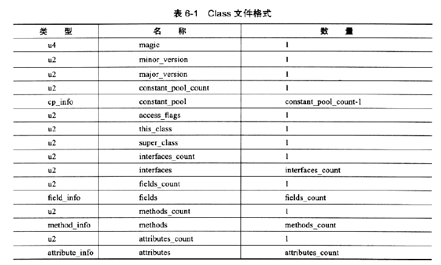

# 第三部分 虚拟机执行子系统
## 六、类文件机构
### 6.1 概述
### 6.2 无关性的基石
Write Once,Run Anywhere!
### 6.3 class文件的结构
1. 对数量、顺序、大小、分隔符等都是有很严格的限制和要求的
2. 表示

    
#### 6.3.1 魔数和Class文件版本
1. 每个class文件的头4个字节称为魔数（Magic Number）；作用：确认这个class文件是否为虚拟机接受的class文件；在计算机中使用很广泛；
2. 魔数后面是第四个字节是Class文件的版本号；第5-6个字节是次版本号（Minor Version）；第7、8个字节是主版本号；Java的版本号是从45开始的
#### 6.3.2 常量池
1. 主次版本号后面就是常量池位置
2. class文件资源仓库
3. class文件结构中和其他项目关联最多的数据类型；占用class空间最大的数据之一；第一个表类型数据项目
4. 常量池入口处会放置一个容量标识（内存偏移地址0x00000008）
5. 分为字面量（符合java层面的常量）和引用符号（编译原理）两大类
6. 符号引用
   1. 类或接口的全限定名
   2. 字段名称和描述符
   3. 方法名称和描述符
7. 常量池的项目类型

   
#### 6.3.3 访问标志
1. 常量池结束后两个字节代表访问标志(access_flag)；
2. 这些标识符作用：比如这个是类还是接口，是否定义成public类型，是否定义了abstract类型，类有没有被声明成final类型，
3. 说明

   
#### 6.3.4 类索引、父类索引和接口索引集合
1. 类索引、父类索引都是一个u2类型的数据；而接口则是一组u2类型的数据的集合
2. 类索引于用于确定这个类的全限定名
3. 父类索引用于确定父类索引的全限定名，并且只有一个。object没有。
4. 接口索引集合用来描述该类实现了那些接口，也就是从左到右的顺序的集合
#### 6.3.5 字段表集合
#### 6.3.6 方法表集合
#### 6.3.7 属性表集合
### 6.4 字节码指令介绍
1. 虚拟机指令是由一个字节字节长度、代表着某种特定操作含义的数字（称为操作码，Opcode）
   以及跟随其后的零至多个代表此操作所需参数（操作数，Operands）而构成。
2. 因为Java虚拟机是面向操作数栈而不是寄存器的结构，所以大多数指令不包含操作数，只包含操作码。
3. Java虚拟机的长度为一个字节，这就说明指令集操作码的总数不能超过256条
4. 这种特点导致在解释指令时会损失部分性能，但是代码精小，可以高效传输
### 6.4.1 字节码与数据类型
### 6.4.2 加载和存储指令
1. 用于将数据在栈帧中局部变量表和操作栈之间来回传输
2. 将一个局部变量加载到操作栈：iload、iload_<n>、aload、aload_<n>
3. 将一个数值从操作栈中存储到局部变量表中：istore、istore_<n>、astore、astore_<n>
4. 将一个常量加载到操作栈中去：dipush、sipush
### 6.4.3 运算指令
1. 用于对两个操作数栈上的值进行某种特定的运算，并把结果重新存入操作数栈顶
2. 分为对整数型和浮点型的运算
3. 没有直接支持byte、short、char和boolean的类型的支持，所以上述的这些都是转换成int进行运算
4. 指令如下

   
5. 虚拟机进行浮点数运算时，采用的是向最近数舍入的模式
6. 浮点数转为整形运算时，所有小数部分的数字会被截掉
7. 对long类型数值进行比较，虚拟机采用带符号的方式进行比较；
### 6.4.4 类型转换指令
1. 用于将不同数值的类型进行互相转换，一般用于在代码中进行显式指定
2. Java虚拟机支持宽化类型转换（即小范围类型到大范围类型的安全转换）。隐式转换
   1. int类型到long、float、double类型
   2. long类型到float、double类型
   3. float类型到double类型
3. 窄化类型转换碧必须显式的进行转换
   1. 如果浮点型值Nan转整形int或long的结果就是0
   2. 在转换的整形范围内转为就是正确的
   3. 超过转换的整形范围的则表示成整形所能表达的最大值或最小值
### 6.4.5 对象的创建和访问指令
1. 类的实例或数组都是对象，但是虚拟机针对其两个创建方式指定了不同的指令
2. 对象创建后就可以通过指令来获取对象实例或数组实例中的字段或数组的元素
   1. 创建类实例的指令：new
   2. 创建数组的指令：newarray anewarray multianewarray
   3. 访问类字段(static)和实例字段的指令：getfield putfield getstatic putstatic
   4. 把一个数组元素加载到操作数栈的指令：baload caload saload iaload laload faload daload aaload
   5. 将一个操作数栈的值存储到数组元素中的指令：bastore castore sastore
   6. 获取数组长度的指令：arraylength
   7. 检查类实例类型的指令：instanceof checkcast
### 6.4.6 操作数栈管理指令
1. 如同操作一个普通数据结构中的堆栈一样，Java虚拟机提供了一些用于直接操作数栈的指令。
   1. 将操作数栈的栈顶的一个或两个元素出栈：pop  pop2
   2. 复制栈顶一个或两个数组并将复制值或双份复制值重新压入栈顶：dup dup2
   3. 将栈最顶端的两个数值互换：swap
### 6.4.7 控制转移指令
1. 该类指令可以让Java虚拟机有条件或无条件地从指定位置指令而不是控制转移指令的下一条指令继续执行程序
   从概念模型上理解：可以认为是控制转移指令就是在有条件或无条件地修改PC寄存器的值。

   1. 条件分支：ifeq iflt ifle ifne ifgt ifge ifnull ifnonnull if_icmpeq、等
   2. 符合条件分支：tableswitch lookupswitch
   3. 无条件分支：goto goto_w jsr jsr_w ret
2. Java虚拟机中有专门的指令集用来处理int和reference类型的条件分支比较操作。对于null,也有
   专门的指令来检测null值
3. 针对boolean、char、byte、char、short类型都是使用int类型比较指令完成的；对于long,float,double类型都是先运行
   其对应的运算指令（cempg）。由于各种类型的比较最终都会转换为int类型进行比较，所以int类型的分支的指令最为丰富
### 6.4.8 方法调用和返回指令
1. 方法调用分为：分派、执行过程
2. 常见指令
   1. invokevirtual指令用于调用对象的实例方法，根据对象的类型进行分派
   2. invokeinterface指令用于调用接口方法。它会在运行时搜索这个接口的实现方法找出合适的方法进行调用
   3. invokespecial用于调用一些需要特殊处理的实例方法，包括实例初始化方法、私有方法和父类方法
   4. invokestatic指令永不调用类方法（static方法）
   5. invokedynamic指令用于在运行时动态解析调用点限定符所引用的方法，并执行该方法
      前4条指令的分派逻辑都是固化在虚拟机内部，而最后一个的分派逻辑都是由用户所设定的引导方法决定的
3. 方法调用指令则与数据类型无关，而方法返回指令则是根据返回值的类型来区分度的。
   1. ireturn  (boolean byte char short int)
   2. lreturn  ()
   3. fretrun
   4. areturn
   5. 还有一个return指令提供声明void的方法和实例初始化方法以及类和接口的的类初始化方法
### 6.4.9 异常处理指令
1. athrow指令来完成显式抛出的异常
2. 除了1中之外还有就是虚拟机自身检测到异常状况时也会自动抛出异常
3. Java虚拟机中处理异常catch语句不是有字节码指令来实现的，（很久之前是使用jsr和ret指令来实现的，现在已经不用了）而是采用
   异常表来实现的
### 6.4.10 同步指令
1. Java虚拟机可以支持方法级和方法内部一段指令序列的同步，这两种同步结构都是使用Monitor来支持的
2. 方法级的同步是隐式的，无需通过字节码指令来控制。可以从方法的常量池的方法表结构中的ACC_SYNCHRONIZED访问标志得知一个方法是否申明成同步
   方法
3. 当方法被调用时，调用指令会先检查方法的ACC_SYNCHRONIZED的访问标志是否被设置。如果设置了
   执行成功的线程就会持有管理，然后才能执行方法，最后当方法执行完成（无论是正常释放还是非正常释放）释放管理。
4. monitorenter  monitorexit
5. 示例

   
### 6.5 公有设计和私有实现
1. Java虚拟机的实现方式有两种
   1. 将深入的Java虚拟机代码在加载或执行时翻译成另外一种虚拟机指令集
   2. 将输入的Java虚拟机代码在加载或执行时翻译成宿主机CPU的本地指令集（即JIT代码生成技术）

### 6.6 Class文件结构的发展
1. Java1.0从诞生以来，一直处理比较稳定的状态
2. 更多增加的就是属性表集合中添加了的如枚举，变长参数、泛型、动态注解等
   ACC_SYNTHETIC,ACC_ANNOTATION,ACC_ENUM

