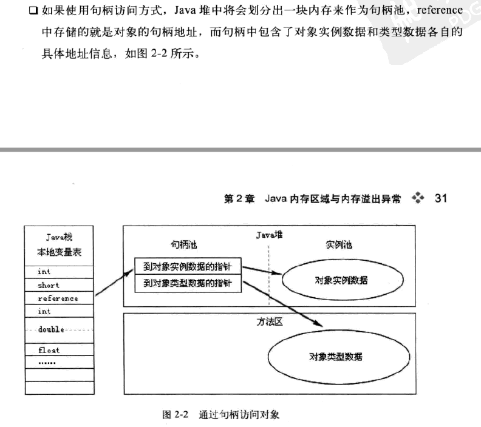

## 二、 Java内存区域和内存溢出异常
### 2.1 概述
### 2.2 运行时数据区域
Java虚拟机规范第二版，内存分布如下：


#### 2.2.1 程序计数器
是一块较小的内存空间。

作用：当前线程所执行的字节码的行号指示器。

由于Java虚拟机的多线程是通过线程轮流切换并分配处理器执行时间的方式来实现的，所以在任何一个确定的时刻，一个处理器（对于多核来说是一个内核）
只会执行一条线程中指令。因此，在线程切换后能恢复到正确的执行位置，每个线程都需要一个独立的程序计数器，各个线程之间计数器互不影响，独立
存储。我们称这样的内存区域为线程私有的内存。

例如：如果线程当前执行的Java方法，则计数器记录的正在执行的虚拟机字节码的指令的地址。如果是Native方法，则计数器为空。

此外此区域不会发生OOMError.

#### 2.2.2 Java虚拟机栈
1. 也是线程私有的，和线程的生命周期一致。
2. 线程请求的栈的深度超过了虚拟机所允许的长度，则会抛出StackOverflowError
3. 如果虚拟机栈动态拓展时，无法申请到足够的内存也会抛出OOM
#### 2.2.3 本地方法栈
1. 本地方法栈和Java虚拟机栈发挥作用类似
2. 虚拟机栈为虚拟机执行Java方法(字节码)服务；本地方法栈则是为虚拟机用到的Native方法服务。
   虚拟机规范中对本地方法栈并没有明确的要求。如hotspot就将虚拟机栈和本地方法栈合二为一。
#### 2.2.4 Java堆（新生代和老年代）
1. java虚拟机管理中最大的一块内存
2. 所有线程共享的一片内存区域，在虚拟机启动时创建（所有的对象实例、数组等都存在于此）
3. 随着JIT技术编译的发展、逃逸分析的。所有的对象都分布在堆中，也不是那么“绝对”
4. Java堆是垃圾回收器的主要管理的内存区域。分代回收算法。
5. Java堆可以物理上不连续，但是逻辑上连续的内存空间即可。
#### 2.2.5 方法区
1. 是各个线程共享的内存区域
2. 作用：用于存储已被虚拟机加载的类的信息、常量、静态变量、即时编译后代码等数据
3. 虽然是Java堆的一个逻辑部分，但是“非堆”进行区别。hotspot叫做永久代。其他版本的虚拟机并不存在
4. Java虚拟机规范规定：当方法区无法满足内存分配需求时，则会抛出OOM
#### 2.2.6 运行时常量池
1. 运行时常量池是方法区的一部分。
2. 运行时常量池相对于Class文件的常量池的内容，就是具备动态特性。
   Java语言并不要求常量一定在编译期间产生，运行期间也有可能将新的常量放入运行时常量池中。
   如String.intern()方法
3. 运行时常量池既然是方法区的一部分，自然会收到方法区内存的限制，当常量池无法申请到内存时就会发生OOM
#### 2.2.7 直接内存
1. 既不是虚拟机运行时数据区一部分，也不是java虚拟机规范中规范的部分。但是此块内存频繁被使用
   很容易发生OOM
2. NIO(直接通过Native函数库调用堆外内存，并将堆外内存的地址的引用存储到DirectByteBuffer对象里)
### 2.3 对象访问
#### 2.3.1 对象的创建
```
Object obj = new Object();
```
#### 2.3.2 对象的内存分布
1. Object obj 会反映到Java栈的本地变量表中
2. new Object()反映到Java中的堆中（形成一个结构化的数据对对象中各个字段进行存储，长度不固定）
   Java堆中必须包含找到此对象类型数据的地址信息（对象类型、父类、实现的接口、方法等）。而这些类型数据则保存在方法区中。
#### 2.3.3 对象的访问定位
1. 句柄方式访问



2. 指针方式访问


3. 优缺点  
   句柄省略了对象移动时，对栈中引用的地址的修改  
   指针速度快，java对象访问频繁，节省了一次时间定位开销。hotspot采用此。

### 2.4实战:OOM异常
1. Java虚拟机规范中，除了程序计数器之外，其他的内存区域都有可能发生OOM
2. 了解虚拟机运行时各个内存区域存储的内容
3. 能够根据异常信息可以快出定位出哪个区域的内存OOM,以及该如何处理
#### 2.4.1 Java堆溢出
1. 使用内存映像分析工具（如Eclipse中的Memory Analyzer）对dump出来的快照进行分析。分清楚是内存泄漏还是内存溢出（确认内存中对象是否有必要存在）
2. 如果是内存泄漏，可以通过工具泄漏对象到GC Roots的引用链。通过对泄漏对象类型信息和引用链,定位到内存泄漏代码的位置
3. 如果不存在泄漏的话，检查虚拟机的内存是不是设置过小了，建议增加容量
#### 2.4.2 虚拟机栈和本地方法栈溢出
1. HotSpot是不区别虚拟机栈和本地方法栈，-Xoss参数是无效的。只能通过-Xss设置栈
2. 虚拟机规范规定的两种内存泄漏的情况：  
   1）如果线程请求的栈的深度大于虚拟机的所允许最大的深度，则抛出StackOverflowError  
   2）如果虚拟机在拓展栈时无法申请到足够的内存空间，则会抛出OutOfMemoryError  
   这二者在一定程度上对一种情况的两种描述，当栈无法分配到内存到底是内存大小不足还是已使用的栈空间太大
3. 


