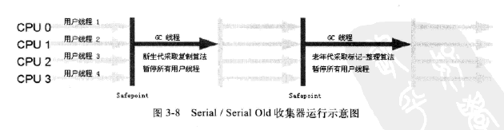

## 三、垃圾回收器和内存分配策略
### 3.1 概述
1. 那些内存需要回收？什么时候进行回收？如何进行回收？
2. 程序计数器、虚拟机栈、本地方法栈这三部分随着线程而生，随着线程而灭。栈中的栈帧随着方法有序的进出。每一个栈帧中分配内存是在类结构确定下来就已知（JIT会在编译时进行些许优化）
3. 因此程序计数器、虚拟机栈、本地方法栈这三者内存分配和回收都具备确定性，垃圾回收再这几块不需要你过多的考虑。他们会随着线程的回收而自动进行回收。
4. Java堆和方法区（Java堆中一个逻辑部分），所以说垃圾回收也是主要考虑到这块的内存的回收和利用。
### 3.2 对象已死？
1. 需要判断Java堆中有哪些对象是活着或者死去（即不可能被任何途径使用的对象）
#### 3.2.1 引用计数算法
1. 引用计数算法很优秀应用很广泛，但是它很难解决对象之间循环依赖的而导致的问题
2. 引用计数算法的存在的缺陷，如上1
3. JavaVM不是通过引用计数来进行垃圾回收的（来判断对象是否存活）
#### 3.2.2 根搜索算法（GC Roots Tracing）
1. Java中可以作为GC Roots对象包括以下几种：
   - 虚拟机栈（栈帧中本地变量表）中引用的对象；
   - 方法区中类的静态属性引用的对象；
   - 方法区中常量引用的对象；
   - 本地方法栈中JNI（一般只Native方法）的引用对象
2. 示例如下
   
#### 3.2.3 再谈引用
1. 1.2之前Java中对象只有：引用和未引用两种状态
2. 1.2之后进行了扩充：强引用（Strong Reference）、软引用（Soft Reference）、弱引用（Weak Reference）、虚引用（Phantom Reference）
   - Strong Reference：只要强引用还存在，垃圾回收器就不会进行回收
   - Soft Reference：一些还有用，但是非必需的对象。系统将要发生OOM时，会将这些对象列入回收范围，并进行第二次垃圾回收。如果回收之后内存还不够则会抛出OOM。Java中提供SoftReference来实现。
   - Weak Reference：描述非必需对象。弱引用的关联的对象只能生存到下一次垃圾回收器发生之前。无论内存是否充足，都会回收掉弱引用关联的对象。WeakReference类
   - Phantom Reference：最弱的一种引用。一个对象是否有虚引用的存在都不会对其生存时间造成影响，也无法通过虚引用来获取一个对象的实例。为一个对象设置、
     虚引用的唯一目的就是希望在该对象被垃圾回收器回收时收到一个系统通知。PhantomReference类。
#### 3.2.4 生存还是死亡
1. 根搜索法不可达的对象，还有两次标记的过程，进行自救。
2. 过程：
   在跟搜索算法不可达的对象，并将第一次被标记并且进行一次筛选。筛选条件是：此对象是否有必要调用finalize()方法。当对象没有覆盖finalize或方法已被虚拟机执行了，虚拟机
   会认为以上两种情况没有必要执行。  
   如果这个对象被判定为有必要执行finalize()方法。该对象将会被F-Queue的队列中，稍后虚拟机将建立一个低优先级的Finalizer线程去执行。这里的执行指的是虚拟机会触发该  
   方法，但是并不承诺等待他运行结束（原因：finalizer执行很慢或死循环，导致队列中其他的对象永远在等待或内存溢出）。finalizer方法是对象逃离死亡的最后一次机会，对象只要finalizer中  
   拯救自己（建立自己引用）第二次标记的时候该对象就被移除回收队列。如果没有拯救，那么很快不久就被回收。但是如果对象的finalizer方法执行了，但是可能该对象还存活着。
3. 实例代码如下：
   ```
       public static FinalizerEscapeGC SAVE_HOOK = null;
   
       public void isAlive() {
           System.out.println("yes, i am still alive!!!");
       }
   
       @Override
       protected void finalize() throws Throwable {
           super.finalize();
           System.out.println("finalizer method execute");
           FinalizerEscapeGC.SAVE_HOOK = this;
       }
   
       public static void main(String[] args) throws Exception {
           SAVE_HOOK = new FinalizerEscapeGC();
           // 对象第一次进行成功的拯救
           SAVE_HOOK = null;
           System.gc();
           // 因为finalizer方法的优先级很低，所以暂停0.5s,以等待他运行
           Thread.sleep(500);
           if (SAVE_HOOK != null) {
               SAVE_HOOK.isAlive();
           } else {
               System.out.println("no, i am dead.");
           }
   
           // 下面的代码和上面的代码一样。但是对象却自救失败了。
           // 对象第二次进行成功的拯救
           SAVE_HOOK = null;
           System.gc();
           // 因为finalizer方法的优先级很低，所以暂停0.5s,以等待他运行
           Thread.sleep(600);
           if (SAVE_HOOK != null) {
               SAVE_HOOK.isAlive();
           } else {
               System.out.println("no, i am dead.");
           }
       }
   ```
4. 在这里，希望大家尽量忘记finalizer()方法能做的事，尽量使用try-finally或其他的方式来替换
#### 3.2.5 回收方法区
1. 方法区有被认为是HotSpot虚拟机中的永久代
2. 误区：Java虚拟机规范中说过，不要求虚拟机在方法区实现垃圾收集，“性价比”很低；回收堆中新生代一般可以回收70%-95%,而永久代的垃圾回收远远低于此
3. 永久代垃圾回收主要包括：废弃常量和无用的类。
4. 回收废弃常量和回收Java堆中对象十分相似。以常量池中的字面值回收为例，“abc”字符串已进入常量池，但是系统中没有任何一个地方
   引用字符串“abc”,也没有其他地方引用。如果这个时候发生内存回收，如果必要的话，该字符串变量则会被回收掉。
5. 判定一个类是否是无用类则比较复杂。
   - 该类的所有实例都已经被回收，也就是Java堆中不存在该类的任何实例
   - 该类的ClassLoader已经被回收
   - 该类对应的java.lang.Class对象没有在任何地方被引用，无法在任何地方通过反射访问该类的方法

   即时是满足以上三个条件，虚拟机也仅仅是可以进行回收。不像对象一样，一定会被回收。对类的回收，Hotspot
   提供了-Xnoclassgc参数进行控制，还可以使用-verbose:class及-XX:+TraceClassLoading、-XX:+TraceClassUnLoading
   其中前两个参数在product版虚拟机中已经支持，最后一个需要FastDebug版的虚拟机支持。

   - 在大量使用反射、动态代理、cglib、jsp、及osgi的虚拟机都需要类的卸载。以免永久代不会溢出。
### 3.3 垃圾收集算法
#### 3.3.1 标记 - 清除算法
1. 首先标记处所有需要回收的对象；其次在标记完成之后统一回收掉所有被标记的对象。
2. 最基础的算法。后续的算法都是基于此，并针对其缺陷进行改进的得到的。
3. 缺点：
   - 效率（不高）标记和清除的效率都不高
   - 空间问题，标记清除后会导致大量不连续的内存碎片，而碎片过多可能会导致以后程序在运作的过程中，分配较大对象时无法找到足够的连续内存
     而不得不触发另一次垃圾回收动作

4. 图解

   
#### 3.3.2 复制算法
1. 为了解决效率问题而出现的复制算法
2. 复制算法：
   - 内容：将可用内存按容量划分成大小相等的两块。每次只是使用其中的一半，将快使用完成后将存活的对象
   复制到另外一块内存上去，然后再把使用过的内存一次清理掉。
   - 好处：每次都是对整块内存进行回收，减少了内存碎片的复杂情况
   - 好处2：移动时只需移动堆顶指针，按照顺序分配即可，简单高效
   - 缺点：内存缩小为原来的一半，有点浪费内存空间
3. 图解

   

4. 现代的商业虚拟机都是都是采用这种算法来回收新生代内存。新生代中对象98%都是朝生夕死。并非严格按照1:1。而是按照8:1。
5. 1块较大的Eden和2块较小的Survivor内存；每次使用Eden和1个Survivor。（Eden:Survivor = 8:1）
6. 这样内存中整个新生代的内存容量为（80+10=90），保证了只有10%的内存容量的浪费。
7. 但是实际发生垃圾回收时我们无法保证98%对象都是标记死亡的，如果存活的对象的占用的内存多于剩下的10%的容量，这时则需要其他内存（老年代）进行分配担保。
#### 3.3.3 标记 - 整理算法
1. 复制算法在对象存活率较多时就需要执行较多的复制操作，效率将会降低。
2. 关键的是，如果不想浪费50%的内存，就需要有额外的内存空间进行分配担保，以应对已使用内存中的对象100%存活的情况。所以老年代一半不会选择此算法（复制算法）。
3. 根据老年代的特点：提出了标记 - 整理算法。标记过程和标记 - 清理一样。但是后续的步骤：不是对可回收的对象进行清理，
   而是让所有存活的对象向一断进行移动。然后清理掉端边界以外的内存
4. 图解

   
####  3.3.4 分代收集算法
1. Java堆：新生代和老年代
2. 新生代：适合复制算法。只需付出复制少量存活对象的成本就可以完成收集。
3. 老年代：（对象的存活率较高，并且没有额外的空间对他进行内存分配）适合使用标记 - 清理或者标记 - 整理算法
### 3.4 HotSpot算法实现
#### 3.4.1 枚举根节点
1. 以GC Roots节点找引用链为例（作为GC Roots节点主要是全局性引用常量或类的静态属性或执行上下文栈帧中的本地变量表）
2. 可达性分析对执行时间十分敏感，GC停顿以确保一致性（Stop The World）
3. 准确式GC、OopMap、
### 3.5 垃圾收集器

#### 3.5.1 Serial收集器
1. 历史悠久，jdk1.3虚拟机新生代唯一选择
2. 单线程收集器；进行GC工作时必须暂停其他所有的工作线程，直到他收集结束
3. 使用复制算法完成

3. 1.3-1.7不断追求GC停顿时间的缩短，而获取更好的体验
#### 3.5.2 ParNew收集器
1. ParNew收集器是多线程版的Serial，除了使用多条线程进行垃圾回收外。其余行为包括Serial可用的所有参数、收集算法、StopTheWorld、对象分配规则、回收策略和Serial垃圾器一致。
2. 图解  
   
3. 除了Serial之外，只有ParNew可以配合CMS工作
4. 也是新生代的收集器
#### 3.5.3 Parallel Scavenge收集器
1. 也是一个新生代的收集器
2. 使用了复制算法同时又是一个并行的多线程收集器
3. CMS关于垃圾收集尽量缩短用户线程停止的时间；Parallel Scavenge目的是达到一个可控制的目标吞吐量。（所谓吞吐量CPU用于运行用户代码时间和CPU总时间的比值。
   吞吐量 = 运行用户代码时间 / (运行用户代码时间和垃圾收集时间)）
4. 停顿时间越短就越适合需要和用户交互的程序，良好的相应的速度可以提升用户体验。高吞吐量则可以最高效的利用CPU时间，尽快完成程序运算任务主要适合在后台运算而不是交互性的程序
5. Parallel Scavenge提供两个参数。-XX:MaxGCPauseMillis(最大垃圾收集停留时间) -XX:GCTimeRatio(设置吞吐量大小)
6. MaxGCPauseMillis:大于0的毫秒值。收集器将尽力保证最大垃圾收集停留时间不超过设定值。
7. GCTimeRatio:大于0小于100的值。默认值99。也就是垃圾收集时间占总时间的比例。吞吐量的倒数。
8. -XX:+UseAdaptiveSizePolicy:开关参数。开启后，无需手动指定新生代的大小、Eden、Survivor之间的比例等其他。又称“GC自适应调节”。自适应也是Parallel Scavenge和ParNew的一个重要区别。
#### 3.5.4 Serial Old收集器
1. Serial Old是Serial收集器的老年代收集器。
2. 单线程收集器。标记 - 清理算法。
3. 主要意思在Client模式下虚拟机使用。
4. Server模式下：

   1）JDK1.5之前版本配合Parallel Scavenge使用

   2）CMS收集器的后备选择
5. 图解

   

#### 3.5.5 Parallel Old收集器
1. 是Parallel Scavenge的老年代版本
2. 使用多线程和标记 - 清除算法
3. JDK1.6后才出现的
4. 图解

   
#### 3.5.6 CMS收集器
1. 一种以获取最短回收停顿时间为目标的垃圾器
2. 基于标记 - 清除算法实现的
3. 实现细节：

   1）初始标记

   2）并发标记

   3）重新标记

   4）并发清除

   其中，初始标记和重新标记还需stop the world。初始标记只是标记一下GC Roots能直接关联到的对象，速度很快。并发标记阶段也就是进行GC Roots Tracing的过程，而重新标记是为了修正
   因用户程序继续运行导致标记变动的那一部分对象的标记记录。重新标记这段时间远比初始标记时间长但是远比并发标记时间短。

   

4. 优点：并发收集、低停顿
5. CMS收集器对CPU资源非常敏感；CMS收集器无法处理浮动垃圾,使其在标记过程失败，从而导致一次FullGC；CMS收集器是基于标记 - 清除的算法，而其算法容易导致内存碎片。
#### 3.5.7 G1收集器
1. 基于标记 - 清理算法，所以对长时间运行的系统，不会产生内存碎片。
2. 可以精准地控制停顿，既能让使用者明确指定在一个长度的时间M毫秒时间片段内，消耗在垃圾收集上的时间不得
   超过N毫秒，这基本是Java(RTSJ)垃圾器的特征
3. G1收集器基本上不牺牲吞吐量的情况下完成低停顿的内存回收；G1将Java堆（新生代和老年代）划分成多个大大小小的独立区域，
   然后进行区域回收
#### 3.5.8 理解GC日志
1. 图片

   

2. 阅读

   1） 最前面的数字：33.125 100.667 代表GC发生的时间；这个是从虚拟机启动来经过的秒数

   2）GC和Full GC说明了此次垃圾收集停顿的类型。不是用来区分新生代GC还是老年代GC。如果有Full，则表明此次GC
   发生了Stop The World

   3)[DefNew  [Tenured [Perm表示GC发生的区域
   Serial收集器中的新生代名为Default New Generation所以显示[DefNew；如果是Parallel收集器新生代名称为
   [ParNew  意为"Parallel New Generation"；如果是Parallel Scavenge收集器新生代名称叫做PSYoungGen。老年代和永久代同理，根据垃圾收集器
   的名称来决定的

   4）方括号内的“3324K --> 152K(3712K)”表示GC前的内存区域已使用容量 -> GC后内存区域已使用的容量（该内存区域总容量）；
   而方括号之外的3324K -> 152K（11904K）表示GC前Java堆已使用的容量->GC后Java堆已使用的容量（Java堆总容量）

   5）0.0025925 secs表示该内存区域GC所占时间，单位是秒。
#### 3.5.9 垃圾收集器参数总结

### 3.6 内存分配和回收策略
Java自动内存管理主要解决了两个问题：
- 给对象分配内存
- 回收分配给对象的内存
#### 3.6.1 对象优先在Eden分配
1. 大多数情况下，对象在Eden区中分配。当Eden内存不足时，虚拟机将发起一次MinorGC
2. 提供了-XX:+PrintGCDetails日志参数。告诉虚拟机发生垃圾回收时打印内存回收日志，并在线程结束后输出各内存的分配情况
3. Minor GC和Full GC
   1. 新生代GC(Minor GC)：回收频繁，且回收速度较快
   2. 老年代GC(Major GC或Full GC)：经常至少伴随着一次Minor GC(并不是绝对，例如PS回收)；Major GC速度至少比Minor GC速度慢10倍以上
4. 示例

   代码

   ```
   /**
    * VM args：-verbose:gc -Xms20M -Xmn10M -XX:SurvivorRatio=8 -XX:+PrintGCDetails
    *
    * @author Leon
    * @version 2019/1/29 9:39
    */
   public class TestAllocation {
   
       private static final int _1MB = 1024 * 1024;
   
       public static void main(String[] args) {
           byte[] allocation1, allocation2, allocation3, allocation4, allocation5;
           allocation1 = new byte[2 * _1MB];
           allocation2 = new byte[2 * _1MB];
           allocation3 = new byte[2 * _1MB];
           allocation3 = new byte[2 * _1MB];
           allocation4 = new byte[2 * _1MB];
           allocation5 = new byte[4 * _1MB];
           // 至少发生了MinorGC
       }
   }
   ```

   GC日志

   ```
   [GC (Allocation Failure) [PSYoungGen: 8010K->792K(9216K)] 8010K->6944K(19456K), 0.0043645 secs] [Times: user=0.00 sys=0.00, real=0.00 secs] 
   [Full GC (Ergonomics) [PSYoungGen: 792K->0K(9216K)] [ParOldGen: 6152K->6802K(26112K)] 6944K->6802K(35328K), [Metaspace: 3206K->3206K(1056768K)], 0.0056064 secs] [Times: user=0.05 sys=0.00, real=0.01 secs] 
   Heap
    PSYoungGen      total 9216K, used 4336K [0x00000000ff600000, 0x0000000100000000, 0x0000000100000000)
     eden space 8192K, 52% used [0x00000000ff600000,0x00000000ffa3c2d8,0x00000000ffe00000)
     from space 1024K, 0% used [0x00000000ffe00000,0x00000000ffe00000,0x00000000fff00000)
     to   space 1024K, 0% used [0x00000000fff00000,0x00000000fff00000,0x0000000100000000)
    ParOldGen       total 26112K, used 10898K [0x0000000084e00000, 0x0000000086780000, 0x00000000ff600000)
     object space 26112K, 41% used [0x0000000084e00000,0x00000000858a4bd0,0x0000000086780000)
    Metaspace       used 3212K, capacity 4496K, committed 4864K, reserved 1056768K
     class space    used 349K, capacity 388K, committed 512K, reserved 1048576K
   ```
#### 3.6.2 大对象直接进入老年代
1. 所谓大对象：需要大量连续内存空间的Java对象。典型的如很长的字符串或数组（上面例子中byte[]就是大对象）
2. 大对象对虚拟机来说是坏事，尤其是那种朝生夕死的大对象。经常内存不足而导致不得不提前进行GC
3. 虚拟机提供-XX:PretenureSizeThreshold参数，使大于此值的对象在老年代分配。好处是避免了在Eden区及两个Survivor区间发生大量的复制。新生代采用复制算法进行垃圾收集。
4. 示例

   ```
   /**
    * VM args：-verbose:gc -Xms20M -Xmn10M -XX:SurvivorRatio=8 -XX:+PrintGCDetails
    *          -XX:PretenureSizeThreshold=3M -XX:+UseSerialGC
    * @author Leon
    * @version 2019/1/29 11:47
    */
   public class TestPretenureThreshold {

       private static final int _1MB = 1024 * 1024;

       public static void main(String[] args) throws Exception {
           byte[] allocation;
           allocation = new byte[4 * _1MB];
           // 直接分配在老年代
       }
   }
   ```

   运行结果

   ```
   Heap
    def new generation   total 9216K, used 1987K [0x00000006c1400000, 0x00000006c1e00000, 0x00000006c1e00000)
     eden space 8192K,  24% used [0x00000006c1400000, 0x00000006c15f0e60, 0x00000006c1c00000)
     from space 1024K,   0% used [0x00000006c1c00000, 0x00000006c1c00000, 0x00000006c1d00000)
     to   space 1024K,   0% used [0x00000006c1d00000, 0x00000006c1d00000, 0x00000006c1e00000)
    tenured generation   total 10240K, used 4096K [0x00000006c1e00000, 0x00000006c2800000, 0x00000007c0000000)
      the space 10240K,  40% used [0x00000006c1e00000, 0x00000006c2200010, 0x00000006c2200200, 0x00000006c2800000)
    Metaspace       used 3148K, capacity 4496K, committed 4864K, reserved 1056768K
     class space    used 341K, capacity 388K, committed 512K, reserved 1048576K
   ```
#### 3.6.3 长期存活的对象将进入老年代
1. 每个对象定义一个年龄（Age）计数器
2. 对象在Survivor区域每熬过一次MinorGC，年龄就会增加。默认年龄为15。当年龄超过一定的阈值就会进入老年代。
   通过参数：-XX:MaxTenuringThreshold设置
3. 实例（-XX:MaxTenuringThreshold=1或15来进行测试）

   代码

   ```
   /**
    * VM args：-verbose:gc -Xms20M -Xmn10M -XX:SurvivorRatio=8 -XX:+PrintGCDetails
    *          -XX:MaxTenuringThreshold=1 -XX:+UseSerialGC
    * @author Leon
    * @version 2019/1/29 11:47
    */
   public class TestTenuringThreshold {

       private final static int _1MB = 1024 * 1024;

       public static void main(String[] args) {
           byte[] allcation1, allcation2, allcation3;
           // 什么时候进入老年代取决于MaxTenuringThreshold的值
           allcation1 = new byte[_1MB / 4];
           allcation2 = new byte[4 * _1MB];
           allcation3 = new byte[4 * _1MB];
           allcation3 = null;
           allcation3 = new byte[4 * _1MB];

       }
   }
   ```

   结果

   ```
   [GC (Allocation Failure) [DefNew: 6175K->885K(9216K), 0.0031569 secs] 6175K->4981K(19456K), 0.0031954 secs] [Times: user=0.00 sys=0.00, real=0.00 secs]
   [GC (Allocation Failure) [DefNew: 5065K->0K(9216K), 0.0010477 secs] 9161K->4975K(19456K), 0.0010657 secs] [Times: user=0.00 sys=0.00, real=0.00 secs]
   Heap
    def new generation   total 9216K, used 4316K [0x00000006c1400000, 0x00000006c1e00000, 0x00000006c1e00000)
     eden space 8192K,  52% used [0x00000006c1400000, 0x00000006c1837000, 0x00000006c1c00000)
     from space 1024K,   0% used [0x00000006c1c00000, 0x00000006c1c003b0, 0x00000006c1d00000)
     to   space 1024K,   0% used [0x00000006c1d00000, 0x00000006c1d00000, 0x00000006c1e00000)
    tenured generation   total 10240K, used 4974K [0x00000006c1e00000, 0x00000006c2800000, 0x00000007c0000000)
      the space 10240K,  48% used [0x00000006c1e00000, 0x00000006c22db9f8, 0x00000006c22dba00, 0x00000006c2800000)
    Metaspace       used 3184K, capacity 4496K, committed 4864K, reserved 1056768K
     class space    used 344K, capacity 388K, committed 512K, reserved 1048576K
   ```

   说明：
   - 当MaxTenuringThreshold=1的情况

     1)首先1,2都被分到Eden中，当3第一次来时，Eden不够4M了，所以进行一次GC，将1放入Survivor，Age+1。
       又因为Survivor只有1M，不够4M，所以直接担保机制，2放入老年代。所以Eden从5726k->616k，总内存基本没变。

     2)当第二次3进来时，发生第二次GC，将原来存在Eden中的3释放(赋值为null了),Survivor中的1已经1岁了，所以存入老年代，
       这时Eden刚释放完3，下一个3还没有进来，所以Eden从4712k->0,总内存由8808k->4706k，GC过后将新的3存入Eden。
       两次GC过后。Eden中存着的是3，老年代中存着的是2和1。此时空间分布Eden(4M)，Survivor from(0M),Old（4.25M）

     3)如果将参数-XX:MaxTenuringThreshold值改为15，两次GC过后应该是Eden中存着3，Survivor中存着1，老年代中存着2。Eden(4M)，Survivor from(0.25M),Old（4M）。但是跑的结果如下。那是因为
       虽然设置了MaxTenuringThreshold为15，但是虚拟机会动态计算这个值。最后2也被移到了老年代。原因见下一小节。

   - MaxTenuringThreshold=15的日志结果
   ```
   [GC (Allocation Failure) [DefNew: 6175K->887K(9216K), 0.0029357 secs] 6175K->4983K(19456K), 0.0029630 secs] [Times: user=0.02 sys=0.00, real=0.00 secs]
   [GC (Allocation Failure) [DefNew: 5067K->0K(9216K), 0.0009721 secs] 9163K->4976K(19456K), 0.0009869 secs] [Times: user=0.00 sys=0.00, real=0.00 secs]
   Heap
    def new generation   total 9216K, used 4316K [0x00000006c1400000, 0x00000006c1e00000, 0x00000006c1e00000)
     eden space 8192K,  52% used [0x00000006c1400000, 0x00000006c1837070, 0x00000006c1c00000)
     from space 1024K,   0% used [0x00000006c1c00000, 0x00000006c1c00208, 0x00000006c1d00000)
     to   space 1024K,   0% used [0x00000006c1d00000, 0x00000006c1d00000, 0x00000006c1e00000)
    tenured generation   total 10240K, used 4976K [0x00000006c1e00000, 0x00000006c2800000, 0x00000007c0000000)
      the space 10240K,  48% used [0x00000006c1e00000, 0x00000006c22dc050, 0x00000006c22dc200, 0x00000006c2800000)
    Metaspace       used 3187K, capacity 4496K, committed 4864K, reserved 1056768K
     class space    used 345K, capacity 388K, committed 512K, reserved 1048576K
   ```
#### 3.6.4 动态对象年龄判断
1. 为了更好的适应不同的程序，虚拟机并不是永远要求对象年龄达到MaxTenuringThreshold才晋升到老年代。
   如果在Survivor空间的相同年龄所有对象大小的总和大于Survivor空间的一半，年龄大于或等于该年龄的对象可以直接进入老年代，无需MaxTenuringThreshold要求的对象。
2. 示例
   ```
   /**
    * VM args：-verbose:gc -Xms20M -Xmn10M -XX:SurvivorRatio=8 -XX:+PrintGCDetails
    *          -XX:MaxTenuringThreshold=1 -XX:+UseSerialGC
    * @author Leon
    * @version 2019/1/29 11:47
    */
   public class TestDynamicTenuringshold {

       private final static int _1MB = 1024 * 1024;

       public static void main(String[] args) {
           byte[] allcation1, allcation2, allcation3, allcation4;
           // 什么时候进入老年代取决于MaxTenuringThreshold的值
           allcation1 = new byte[_1MB / 4];
           allcation2 = new byte[_1MB / 4];
           allcation3 = new byte[4 * _1MB];
           allcation4 = new byte[4 * _1MB];
           allcation4 = null;
           allcation4 = new byte[4 * _1MB];

       }
   }
   ```

   日志

   ```
   [GC (Allocation Failure) [DefNew: 6431K->1024K(9216K), 0.0028471 secs] 6431K->5237K(19456K), 0.0028805 secs] [Times: user=0.00 sys=0.00, real=0.00 secs]
   [GC (Allocation Failure) [DefNew: 5204K->0K(9216K), 0.0009744 secs] 9417K->5237K(19456K), 0.0009888 secs] [Times: user=0.00 sys=0.00, real=0.00 secs]
   Heap
    def new generation   total 9216K, used 4316K [0x00000006c1400000, 0x00000006c1e00000, 0x00000006c1e00000)
     eden space 8192K,  52% used [0x00000006c1400000, 0x00000006c1836f30, 0x00000006c1c00000)
     from space 1024K,   0% used [0x00000006c1c00000, 0x00000006c1c00320, 0x00000006c1d00000)
     to   space 1024K,   0% used [0x00000006c1d00000, 0x00000006c1d00000, 0x00000006c1e00000)
    tenured generation   total 10240K, used 5236K [0x00000006c1e00000, 0x00000006c2800000, 0x00000007c0000000)
      the space 10240K,  51% used [0x00000006c1e00000, 0x00000006c231d3e0, 0x00000006c231d400, 0x00000006c2800000)
    Metaspace       used 3184K, capacity 4496K, committed 4864K, reserved 1056768K
     class space    used 344K, capacity 388K, committed 512K, reserved 1048576K
   ```
#### 3.6.5 空间分配担保
1. 在发生MinorGC之前，虚拟机会先检查老年代最大可用的连续空间是否大于新生代的所有对象的总和。如果成立，
   那么MinorGC则是安全的。如果不成立，则虚拟机会查看HandlePromotionFailure设置值是否允许担保失败。
   如果允许，那么会继续检查老年代的最大连续可用空间是否大于历次晋升到老年代对象的平均大小，如果大于，将尝试
   进行一次MinorGC,尽管这次MinorGC是有风险的；如果小于或者HandlePromotionFailure设置不允许冒险，那么这时就要改进成
   一次Full GC
2. 冒险的含义：
   新生代采用复制算法，但是为了提高内存利用率，只使用其中一个Survivor空间作为轮换备份。因此当出现大量对象在MinorGC后仍然存活的情况（最极端的情况就是
   就是所有的新生代的对象都存活了下来）这时就需要老年代来进行分配担保，把Survivor无法容纳的对象直接放入老年代。老年代要进行这样的担保，前提是老年代本身还有
   容纳这些对象的剩余空间，一共有多少对象活下来在实际完成内存回收之前是无法确定知道的，所以只好之前每一次回收晋升到老年代对象容量的平均值大小作为经验值，与老年代剩余的空间
   做对比，来决定是否进行Full GC来让老年代腾出更多的空间。

   其实取平均值进行比较仍然是一种动态概率手段。也就是说某次Minor GC后存活的对象突增，远远高于平均值的话，依然会导致担保失败。如果担保失败的话，只好在失败后重新发起一次Full GC.
3. 示例
   ```
   /**
    * VM args：-verbose:gc -Xms20M -Xmn10M -XX:SurvivorRatio=8 -XX:+PrintGCDetails -XX:+UseSerialGC
    *
    * @author Leon
    * @version 2019/1/30 10:47
    */
   public class TestHandlePromotion {
   
       private static final int _1MB = 1024 * 1024;
   
       public static void main(String[] args) throws Exception {
           byte[] a1, a2, a3, a4, a5, a6, a7;
           a1 = new byte[2 * _1MB];
           a2 = new byte[2 * _1MB];
           a3 = new byte[2 * _1MB];
           a1 = null;
           a4 = new byte[2 * _1MB];
           a5 = new byte[2 * _1MB];
           a6 = new byte[2 * _1MB];
           a4 = null;
           a5 = null;
           a6 = null;
           a7 = new byte[2 * _1MB];
       }
   }
   ```

   日志
   ```
   [GC (Allocation Failure) [DefNew: 8010K->659K(9216K), 0.0034787 secs] 8010K->4756K(19456K), 0.0035193 secs] [Times: user=0.00 sys=0.00, real=0.00 secs] 
   [GC (Allocation Failure) [DefNew: 6962K->0K(9216K), 0.0009555 secs] 11058K->4748K(19456K), 0.0009757 secs] [Times: user=0.00 sys=0.00, real=0.00 secs] 
   Heap
    def new generation   total 9216K, used 2212K [0x0000000084e00000, 0x0000000085800000, 0x0000000085800000)
     eden space 8192K,  27% used [0x0000000084e00000, 0x00000000850290e0, 0x0000000085600000)
     from space 1024K,   0% used [0x0000000085600000, 0x0000000085600000, 0x0000000085700000)
     to   space 1024K,   0% used [0x0000000085700000, 0x0000000085700000, 0x0000000085800000)
    tenured generation   total 10240K, used 4748K [0x0000000085800000, 0x0000000086200000, 0x0000000100000000)
      the space 10240K,  46% used [0x0000000085800000, 0x0000000085ca32f8, 0x0000000085ca3400, 0x0000000086200000)
    Metaspace       used 3214K, capacity 4496K, committed 4864K, reserved 1056768K
     class space    used 349K, capacity 388K, committed 512K, reserved 1048576K
   ```

   说明

   1. 发生了两次GC，第一次发生在给allocation4分配内存空间时，由于老年代的连续可用空间大于存活的对象总和，所以allocation2、allocation3将会进入老年代，allocation1的空间将被回收，allocation4分配在新生代。
   2. 第二次发生在给allocation7分配内存空间时，此次GC将allocation4、allocation5、allocation6所占的内存全部回收。最后，allocation2、allocation3在老年代，allocation7在新生代。
4. JDK6 UPDATE之后HandlePromotionFailure参数无效。规则变成只要老年代连续内存空间大于新生代对象的总大小或者历次晋升平均值大小就会进行Full GC，否则就是Minor GC。


