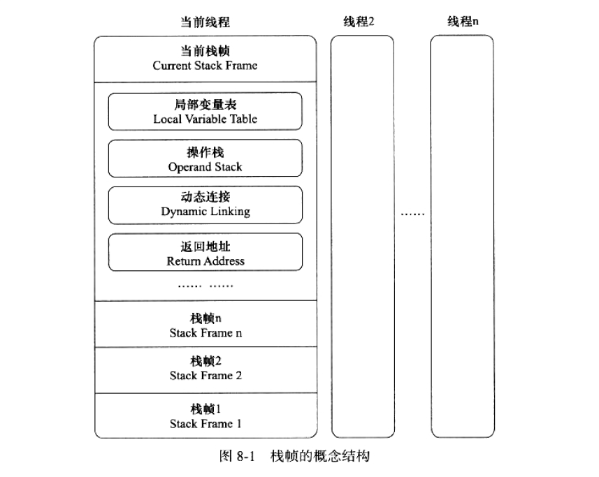
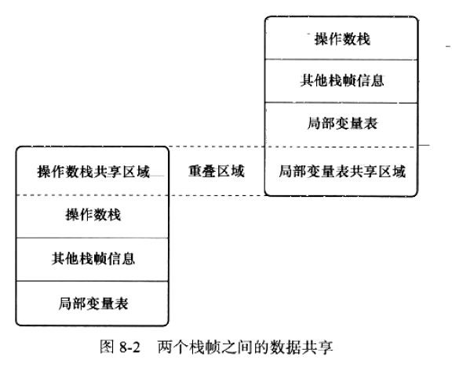
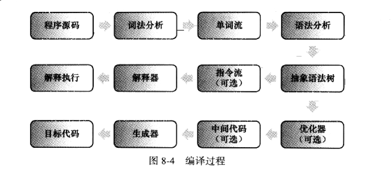
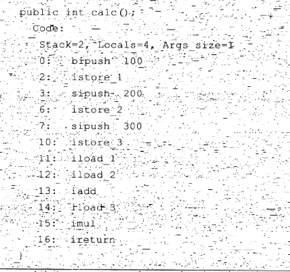
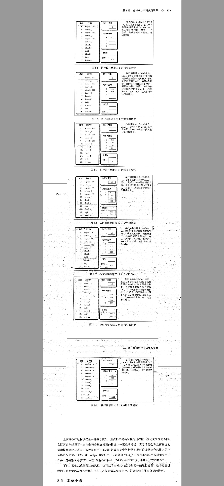

## 第八章 虚拟机字节码执行引擎
### 1. 概述
1. 执行引擎是Java虚拟机最核心的组成部分之一
2. 虚拟机字节码执行引擎概念模型
### 2. 运行时的栈帧结构
1. 栈帧用于支持虚拟机进行方法调用和方法执行的数据结构。
2. 存储了方法的局部变量、操作数栈、动态连接和方法返回地址以及一些额外的附加信息
3. 在编译程序代码时，栈帧需要多大的局部变量表，多深的操作数栈都是完全确定的，并写入方法区的Code属性中去
4. 栈帧结构图

   
#### 2.1 局部变量表
1. 局部变量表是一组变量值存储空间，用户存放方法参数和方法内定义的局部变量
2. Java程序编译成class文件时，就在方法的Code属性的max_locals数据项中确定了该方法所需分配的局部变量表的最大容量
3. 局部变量表的容量已变量槽（Variable Slot）为最小单位，虚拟机规范并没有明确指出每个Slot的大小
4. 每个槽可以存放的数据类型有：boolean byte char short int float reference returnAddress 8种数据类型
5. 以上8种数据类型都可以使用32位或更小的物理空间进行存储。64位虚拟机使用64的物理内存去实现一个Slot
6. 关于4-5中的数据类型的补充：
   1. reference类型：表示对一个对象实例的引用。规范中没有说明其长度和结构。但是一般需要做到以下两点：
      一是可以从此引用中直接或间接查找到对象在Java堆中的数据存放的其实地址索引。
      二是从此引用中直接或间接地查找到对象所属的数据类型在方法区中存储的类型信息，否则无法实现Java规定语法规范
   2. returnAddress类：目前已经很少见。它为jsr、jsr_w和ret字节码指令服务，指向了一个
      字节码指令的地址。古老的虚拟机曾使用过这几条指令实现异常处理，但是现在已被异常表替代了
7. 对于64位数据类型，虚拟机会分配两个连续的Slot。Java中明确规定：double long是
   64位的，reference可能是64也可能是32。

   不过针对double long数据进行分割，在方法区私有内存中是不存在数据安全问题的
8. 虚拟机使用索引定位的方式使用局部变量表：范围0到局表变量表的最大Slot。
   1. 32位的数据就是第n个Slot
   2. 64位的则是n n+1两个Slot。但是针对64的数据明确不允许单独访问其中一个。
9. 方法执行时：虚拟机使用局部变量表完成参数值到参数列表的传递过程。如果执行的
   是实例方法（非static方法），那么局部变量表中第0位索引的Slot默认传递方法所属的
   对象的实例引用。在方法中可以通过关键字this来访问到这个隐含的参数。其余的参数都是按照参数表的顺序
   排列，占用从1开始的局部变量Slot,参数表配置完毕后，在根据方法体内部定义的变量顺序和作用域分配其余的Slot
10. 针对9中的，为了节省栈帧空间，局部变量表中的Slot是可以重用的。方法体定义的变量其作用域的范围不一定会覆盖整个
    方法体，当当前字节码的PC计数器的值超出讴歌变量的作用域外，那么这个变量对应的Slot就可以交给其他变量使用。当然也有一些
    额外的副作用：就是Slot的复用会影戏系统的垃圾回收行为。
11. Slot复用的副作用示例：
    ```
    /**
     * 参数：-verbose:gc
     *
     * @author Leon
     * @version 2019/2/23 11:54
     */
    public class SlotClassDemo {
    
        public static void main(String[] args) throws Exception {
            byte[] placeholder = new byte[64 * 1024 * 1204];
            System.gc();
        }
    }
    ```

    打印结果：

    ```
    [GC (System.gc())  81026K->77920K(251392K), 0.0009697 secs]
    [Full GC (System.gc())  77920K->77711K(251392K), 0.0054776 secs]
    ```

    说明：
    <font color='red'>**没有回收placeholder所占的内存，因为在执行System.gc()时，placeholder还处在作用域之内，所以虚拟机并没有回收**</font>

    第一次修改如下所示：

    ```
    /**
     * 参数：-verbose:gc
     *
     * @author Leon
     * @version 2019/2/23 11:54
     */
    public class SlotClassDemo {
    
        public static void main(String[] args) throws Exception {
            {
                byte[] placeholder = new byte[64 * 1024 * 1204];
            }
            System.gc();
        }
    }
    ```

    运行结果：

    ```
    [GC (System.gc())  81026K->77936K(251392K), 0.0011928 secs]
    [Full GC (System.gc())  77936K->77711K(251392K), 0.0053018 secs]
    ```

    说明：
    <font color='red'>**加入{}，placeholder的作用被限定了。后面再执行System.gc()时，虚拟机为什么不对placeholder进行回收呢？
    让我们带着这个疑问进入下面的第二次修改**</font>：

    第二次修改如下：

    ```
    /**
     * 参数：-verbose:gc
     *
     * @author Leon
     * @version 2019/2/23 11:54
     */
    public class SlotClassDemo {
    
        public static void main(String[] args) throws Exception {
            {
                byte[] placeholder = new byte[64 * 1024 * 1204];
            }
            int a = 0;
            System.gc();
        }
    }
    ```

    运行结果：

    ```
    [GC (System.gc())  81026K->77904K(251392K), 0.0009206 secs]
    [Full GC (System.gc())  77904K->655K(251392K), 0.0046984 secs]
    ```

    说明：
    <font color='red'>**这次内存被回收了。placeholder被回收的根本原因：局部变量表中的Slot是否还存在关于placeholder
    数组对象的引用。第一次修改中，代码虽然已经离开了placeholder的作用域，但是在此之后没有任何对局部变量表的读写操作，placeholder
    原本占用的Slot还没有被其他变量所复用，所以作为GC Roots的一部分的局部变量表仍然保持着对它的关联。这种关联没有被及时
    打断，在绝大多数情况下影响还是很轻微。但是如果遇到一个方法，在其后面有一些很长的耗时操作，而前面又定义了占用了大量内存，
    实际上已经不会再使用的变量，手动将其设置null值，（这里就是int a=0;把对象对应的局部变量表Slot清空）不见得是一个无意义的操作。
    这种操作在特殊情况下，对占用内存大，栈帧长时间得不到回收，方法调用次数达不到JIT编译条件来使用都是很好的。**</font>
12. 局部变量必须初始化和类变量不一定需要初始化的。字节码解析方面的原理解释。
#### 2.2 操作数栈
1. 也称操作栈。LIFO栈。
2. 同局部变量表一样，操作数栈的最大深度也在编译的时候写入到Code属性的max_stacks数据项中。在方法执行的时候，任何时候栈深都不会超过max_stacks的值。
3. 操作数栈的每一个元素可以任意的Java数据类型，包括long和double.32位数据占容量1,64位数据占2.
4. 一个方法刚开始执行的时候操作数栈是空的。在方法的执行过程中，会有各种字节码指令往
   其中写入和提取内容。也是出栈和入栈。
5. 在概念模型中，两个栈帧作为虚拟机的元素是完全独立的个体。但是在大多数的虚拟机中
   会进行一些优化。如使得两个栈帧出现一部分的重叠。这样就可以共有一部分数据，无需额外的
   参数复制传递。

   
6. Java虚拟机的解释执行引擎被称为“基于栈的执行引擎”。其中栈就是操作数栈。
#### 2.3 动态连接
1. 每个栈帧都包含一个指向运行时常量池中该栈帧所属的方法引用，持有这个引用是为了
   支持方法调用过程中动态连接。
2. 静态解析和动态连接。
#### 2.4 方法返回地址
1. 正常完成出口

   执行引擎遇到任意方法的返回字节码指令，这时候可能会有返回值传递给上层的方法调用者
   至于是否有返回值和返回值类型都将根据任何方法返回指令来决定。

2. 异常完成出口

   方法执行的过程中遇到了异常，并且这个异常在方法体中得到处理。无论是Java虚拟机内部的异常
   还是代码中使用athrow字节码指令产生的异常，只要在本方法的异常表中没有搜索到
   匹配的异常处理器就会导致方法的退出。一个异常出口的退出是不会给他的上层调用者产生任何返回值。
3. 方法退出的过程就等同于把当前栈帧出栈。
#### 2.5 附加信息
1. 虚拟机规范允许具体的虚拟机实现可以增加一些规范中没有描述的信息到栈帧中，如调试相关的信息
### 3. 方法调用
方法调用并不等同于方法执行。方法调用阶段唯一的任务就是被调用方法的版本（即调用哪一个方法），暂时还不涉及方法内部的运行
过程。在程序运行过程中，进行方法调用是最普遍、最频繁的操作。

Class文件在编译工程不包含传统过程中连接步骤，一切方法的在Class文件中存储的都是符号引用，并不是方法在实际运行过程中的内存布局
的入口地址（也就是直接引用）。正是因为这个特性也给Java带来了强大的动态拓展能力，但是也使得Java的方法调用过程复杂起来。需要在
类加载期间甚至到运行期间才能确定目标方法的直接引用。
#### 3.1 解析（调用）
1. 所有方法调用中的目标方法在Class文件中都是一个常量池的符号引用，在类加载的解析阶段，会将其中一部分的符号引用转化为直接
   引用，这种解析能成立的前提是：方法在程序真正运行之前就有了一个可确定调用版本，并且这个方法的调用版本在运行期是不可改变的。

   换句话说，调用目标在程序代码写好、编译器进行编译时就必须确定下来，这类方法的调用被称为解析。（Resolution）
2. "编译时可知，运行期不可变"包括静态方法（与类型进行关联）和私有方法（外部不可访问）。
   invokestatic：调用静态方法
   invokespecial:调用实例构造器<init>方法，私有方法和父类方法
   invokevirtual:调用所有的虚方法
   invokeinterface:调用接口方法，会在运行时在确定一个实现了此接口的对象
   invokedynamic:先在运行时动态解析出调用点限定符所引用的方法。
3. 非虚方法：符合invokestatic invokespecal指令调用。符合条件的有：静态方法、私有方法、实力构造器、父类方法、final方法。
   他们在类加载解析时就会把符号引用解析为该方法的直接引用。
4. 虚方法：和3相反之外的方法。（除去final）
5. 解析调用是一个静态过程，在编译期间就能完全确定。在类加载解析阶段就会把涉及到的符号引用全部转换为可确定的直接引用。
   不会延迟到运行期再去完成。
#### 3.2 分派（调用）
1. 分派有可能是静态也有可能是动态的。分为单分派和多分派。最后有静态单分派，静态多分派，动态单分派，动态多分派。
2. 静态分派
   1. 示例代码
      ```
      public class StaticDispatch {
      
          public static void main(String[] args) throws Exception {
              Human man = new Man();
              Human woman = new Woman();
              StaticDispatch sd = new StaticDispatch();
              sd.sayHello(man);
              sd.sayHello(woman);
          }
      
          static class Human {}
      
          static class Man extends Human {}
      
          static class Woman extends Human {}
      
          public static void sayHello(Human guy) {
              System.out.println("hello guy");
          }
      
          public static void sayHello(Man guy) {
              System.out.println("hello gentlemen");
          }
      
          public static void sayHello(Woman guy) {
              System.out.println("hello lady");
          }
      }
      ```
   2. 执行结果
      ```
      hello guy
      hello guy
      ```
   3. 静态分派的典型应用就是方法重载
   4. 重载方法的优先级
   5. 和解析调用的关系
      二者并不是二选一，排他关系。它们是在不同层次筛选和确定目标方法的过程。静态方法会类加载阶段进行解析，而静态方法也是可以拥有多个重载版本的。选择重载
      版本的过程也是通过静态分派完成。

3. 动态分派
   1. 动态分派的典型体现：方法重写
   2. 示例代码
      ```
      public class DynamicDispatch {
      
          public static void main(String[] args) {
              Human man = new Man();
              Human woman = new Woman();
              man.sayHello();
              woman.sayHello();
          }
      
          static abstract class Human {
              abstract void sayHello();
          }
      
          static class Man extends Human {
              @Override
              void sayHello() {
                  System.out.println("man sayHello");
              }
          }
      
          static class Woman extends Human {
              @Override
              void sayHello() {
                  System.out.println("woman sayHello");
              }
          }
      }
      ```
   3. 运行结果
      ```
      man sayHello
      woman sayHello
      ```
   4. 说明
      根据class字节码指令可知：invokevirtual

      该指令的解析的过程大概分为以下几个步骤（也就是多态的寻找查找过程）：
      1. 找到操作数栈顶的第一个元素所指向的对象的实际类型，记做C
      2. 如果在类型C中找到了与常量中描述符和简单名称都符合的方法，则进行访问权限校验，如果通过则返回这个方法的
         直接引用，查找结束。如果不通过，则返回IllegalAccessError异常。
      3. 否则就按照继承关系从下往上依次对C中个各个父类进行2步中的搜索和验证
      4. 如果始终没有找到合适的方法，则抛出IllegalAccessError异常。
   这就是Java中方法重写的本质。这种运行期根据实际类型确定方法的执行版本的分派过程称为动态分派。
4. 单分派和多分派
   1. 方法的接受者和方法的参数统称为方法的宗量。根据分派基于多少种宗量可以将分派划分为单分派和多分派。
   2. 示例代码
      ```
      public class Dispatch {
      
          public static void main(String[] args) {
              Father father = new Father();
              Father son = new Son();
              father.hardChoice(new _360());
              son.hardChoice(new QQ());
          }
      
          static class QQ {}
      
          static class _360 {}
      
          public static class Father {
              public void hardChoice(QQ qq) {
                  System.out.println("father hard choose qq");
              }
      
              public void hardChoice(_360 _360) {
                  System.out.println("father hard choose 360");
              }
          }
      
          public static class Son extends Father {
      
              @Override
              public void hardChoice(QQ qq) {
                  System.out.println("son hard choose qq");
              }
      
              @Override
              public void hardChoice(_360 _360) {
                  System.out.println("son hard choose 360");
              }
          }
      }
      ```
   3. 执行结果
      ```
      father hard choose 360
      son hard choose qq
      ```
   4. 说明

      Java是静态多分派和动态单分派语言。
5. 虚拟机中动态分派的实现
   略
### 4. 基于栈的字节码解释执行引擎
1. 分为解释执行（解释器执行）和编译执行（通过即时编译器产生本地代码执行）
#### 4.1 解释执行
1. Java语言中,javac编译器完成了程序代码经过词法分析、语法分析到抽象语法树，在遍历语法树生成线性的字节码指令流的过程。
   因为这一部分动作是在Java虚拟机之外进行的，而在解释器在虚拟机的内部，所以Java程序的编译就是半独立的实现。
2. 图示

   
#### 4.2 基于栈的指令集和基于寄存器的指令集
1. 栈指令集：可移植性好；速度稍慢；受限于内存的访问速度；
2. 寄存器指令集：速度快；一致性差；更少的指令交互有利于效率提高。
#### 4.3 基于栈的解释器的执行过程
1. 代码
   ```
       public int calc() {
           int a = 100;
           int b = 200;
           int c = 300;
           return (a + b) * c;
       }
   ```
2. 字节码
   
3. 执行过程分析

   

   上面的执行过程仅仅是一个概念模型而已。虚拟机在实际运行过程中会进行各种各样的优化来提高
   性能。实际的运作过程不一定符合上述概念模型。但是我们可以看出整个运算过程都是基于操作数栈进行
   入栈和出栈操作进行信息交换。


