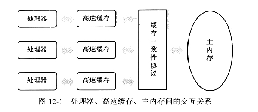
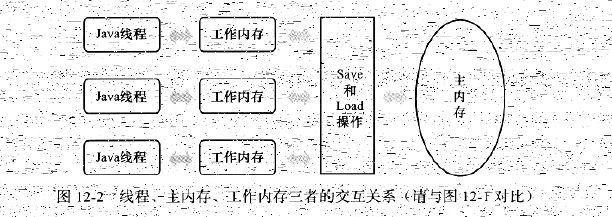

## JVM之Java内存模型（JMM）与线程
### 1. 概述
略
### 2. 硬件的效率和一致性

### 3. Java内存模型
1. 必要性
   Java内存模型可以用来屏蔽各种硬件和操作系统访问内存的差异，以实现Java程序在不同的平台下达到一致的内存访问效果。
   
   >相比C和C++而言，他们直接使用物理硬件和操作系统的内存模型，但是由于不同平台的内存模型的差异，可能同样的程序在一个平台上运行正常，
   >在另外一个平台可能就会出现频繁出错的现象。因此，他们经常需要针对不同的平台编写不同的程序以此来避免这样的问题。而Java的跨平台性就体现在
   >在这里。
#### 3.1 主内存和工作内存
1. Java内存模型

   Java内存模型主要定义是程序中各个变量的访问规则。即虚拟机将变量存储到内存中，如何从内存中取出变量的这样的操作细节。
   >这里所指的变量说的是实例变量、静态变量及构成数组对象元素，而局部变量、方法参数是线程私有的，所以不存在数据共享问题，也不存在
   >竞争问题。
2. 内存分布
   
   Java内存模型规定所有变量都存储于主内存，每个线程还有自己的工作内存，线程中的工作内存保存了主内存变量的副本的拷贝。
   
   >线程对变量的操作，必须都在工作内存中进行操作，不能直接对主内存进行操作。
   >线程之间的变量值传递也需要通过主内存进行。
3. 关系图
   
      
#### 3.1 主内存和工作内存
#### 3.1 主内存和工作内存

### 4. Java与线程

