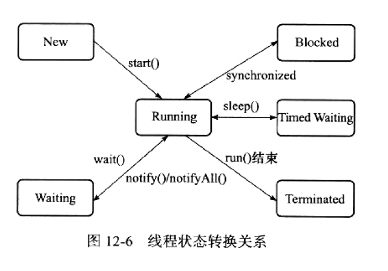

## JVM之Java内存模型（JMM）与线程
### 1. 概述
略
### 2. 硬件的效率和一致性

### 3. Java内存模型
1. 必要性
   Java内存模型可以用来屏蔽各种硬件和操作系统访问内存的差异，以实现Java程序在不同的平台下达到一致的内存访问效果。
   
   >相比C和C++而言，他们直接使用物理硬件和操作系统的内存模型，但是由于不同平台的内存模型的差异，可能同样的程序在一个平台上运行正常，
   >在另外一个平台可能就会出现频繁出错的现象。因此，他们经常需要针对不同的平台编写不同的程序以此来避免这样的问题。而Java的跨平台性就体现在
   >在这里。
#### 3.1 主内存和工作内存
1. Java内存模型

   Java内存模型主要定义是程序中各个变量的访问规则。即虚拟机将变量存储到内存中，如何从内存中取出变量的这样的操作细节。
   >这里所指的变量说的是实例变量、静态变量及构成数组对象元素，而局部变量、方法参数是线程私有的，所以不存在数据共享问题，也不存在
   >竞争问题。
2. 内存分布
   
   Java内存模型规定所有变量都存储于主内存，每个线程还有自己的工作内存，线程中的工作内存保存了主内存变量的副本的拷贝。
   
   >线程对变量的操作，必须都在工作内存中进行操作，不能直接对主内存进行操作。
   >线程之间的变量值传递也需要通过主内存进行。
3. 关系图
   
      
#### 3.2 内存间交互操作
1. **主内存和工作内存之间的具体协议**
   
   即一个变量如何从主内存拷贝到工作内存内存；如何从工作内存同步到主内存之类的实现细节？
   
2. 8种操作
   
   - lock:锁定
   - unlock:解锁
   - read:读取
   - load:载入
   - use:使用
   - assign:赋值
   - store:存储
   - write:写入
3. 说明
   - 如果把一个变量从主内存复制到工作内存中，必须要顺序执行read->load
   - 如果把一个变量从工作内存复制到主内存中，必须要顺序执行store->write
#### 3.3 对volatile型变量的特殊规则
1. 说明

   volatile是Java虚拟机提供的最轻量级的同步机制了
2. 两种特性
   1. 可见性
      - 保证此变量对所有线程的可见性。
        >假如说线程A修改了变量，那么其他线程是可以立即读到此值的。对于普通变量来说，
        >是做不到这一点的，它必须通过主内存才能使得其他线程获取最新的值
        >（A线程存储写入到主内存，B线程读取加载此变量，才能最终到变量的最新值）。
      - "基于volatile变量的在并发运算中线程安全的"这种说法是错误的。
      - volatile保证了变量了可见性，但是并没有保证变量的原子性。
        >在不满足以下规则下，还是需要synchronized或juc来保证原子性
        > 1. 运算结果并不依赖当前值
        > 2. 只有单一变量才能改变变量值（一写多读的情况）
        > 3. 变量不和其他变量共同参与不变约束
   2. 禁止指令重排序的优化
      - 例子略
#### 3.4 对于long和double型变量的特殊规则
1. JVM对上述8种操作都具有原子性，但是对于double和long类型(64位的数据)，允许没有被volatile的变量
   对64位数据的读写可以划分为两次32位操作。
   >所以针对没有被volatile修饰的long或double又可能，被读取或操作到一半的的数值。
2.  现在的商业虚拟机不存在1中所说的情况，都进行了限制。
#### 3.5 原子性、可见性与有序性
1. 原子性
   
   synchronized
2. 可见性
   
   当一个线程修改了共享变量，其他线程可以立刻获取这次修改。
   其实volatile变量和普通变量基本上一致的，唯一的区别就在于在对volatile变量的修改，其他线程是可以立刻
   感知到的，而普通变量则是不能保证这一点的。
   >除了volatile之外，final和synchronized也保证了普通变量的可见性。
3. 有序性
   - 在本线程中观察，所有的操作都是有序的。从别的线程观察次线程，所有的操作都是乱序的。
   - "前半句Java程序的串行化语言。后半句指的是指令重排。"
     >Java提供了volatile和synchronized关键字来禁止指令重排，保证有序性。
#### 3.6 先行发生原则
1. 定义
   
   如果说操作A先行发生于操作B。其实也就是在说发生操作B之前，操作A产生的影响都能被操作B观察到。
   >"影响"包括修改共享变量的值、发送消息、调用了方法
   
### 4. Java与线程
#### 4.1 线程的实现
1. 使用内核线程实现
2. 使用用户线程实现
3. 使用用户线程加轻量级进程混合实现
4. Java线程的实现
#### 4.2 Java线程的调度
#### 4.3 Java线程的状态
1. 5种状态
   - New 新建
   - Runnable 运行
   - Waiting 无限期等待
   - Timed Waiting 限期等待
   - Blocked 阻塞
   - Terminated 结束
2. 转换示意图

   

