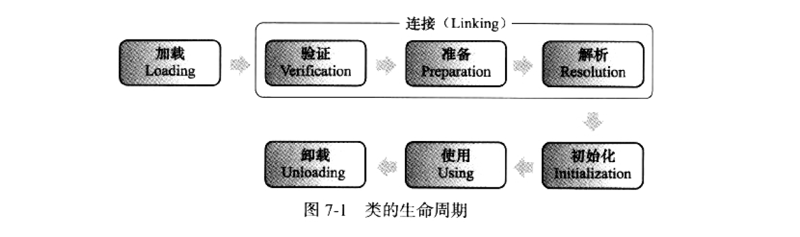
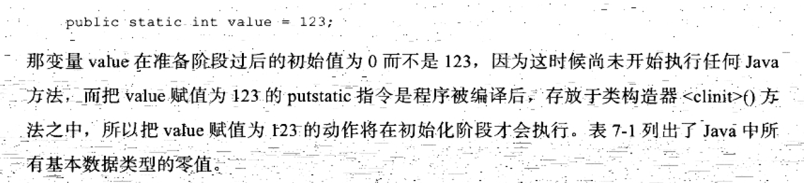
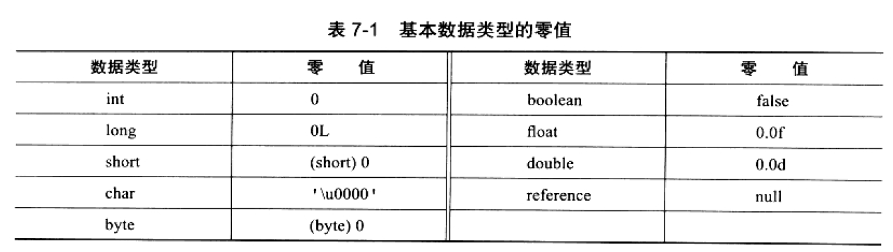
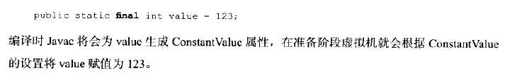

## 第七章 虚拟机类加载机制
### 7.1 概述
1. 在了解class的文件的存储格式后，在class文件中描述的各类信息必须加载到虚拟机中才能运行和使用
2. 虚拟机把类的数据从class文件加载到内存，并对数据进行校验、转换解析和初始化，最终形成虚拟机可以直接使用的Java类型
### 7.2 类的加载时机
1. 类的整个生命周期：
   
   加载（Loading） 验证（Verification） 准备（Preparation） 解析（Resolution） 初始化（Initialization）、使用（Using） 卸载（Unloading）
2. 验证、准备、解析3个部分称为连接（Linking）
3. 图示
   
   
4. 加载、验证、准备、初始化和卸载这5个阶段的顺序是确定。但是解析阶段和初始化节点不一定。也就是Java的动态绑定。
5. 什么时候执行加载Java虚拟机并没有规定
6. 但是对于什么时候进行初始化节点，则是有5种情况进行了规定（当然加载、验证、准备再此之前已经完成）
   1) 遇到new,getstatic,putstatic,invokestatic四条字节码指令时，如果类没有进行初始化，则需要先触发其初始化
      常见的使用场景：使用new关键字实例化对象的时候、读取或设置一个类的静态字段（final修饰除外）、以及调用一个的类的静态方法时
   2) 使用java.lang.reflect包的方法对类进行反射调用的时候，如果类没有进行初始化，则需要先触发其初始化
   3) 当初始化一个类时候，如果其父类没有初始化，则需要先初始化其父类
   4) 当虚拟机启动时，用户需要指定一个执行的主类（包含main方法），虚拟机会先初始化这个类
   5) JDK1.7中动态语言支持时，解析实例结果对应的是有关静态的句柄，并且句柄所在的对应类没有初始化
      则需要触发其初始化
      
   对于上述五种情形：有且只有。五种场景的行为被称为对一个类的主动引用。
   
   除此之外，所有引用类的方式都不会触发初始化，称之为被动引用。
7. 被动引用的示例
   1) 子类访问父类的静态变量
   2) 通过数组定义来引用类，不会触发此类的初始化
   3) 使用类的常量（final修饰）
8. 接口和类的大体相似。
   
   只有在第三种场景下有所不同：接口在初始化的时候并不要求全部的父接口全部完成初始化，
   只有在真正使用父接口的时候才会初始化（如引用接口中定义的常量）
### 7.3 类的加载过程
#### 7.3.1 加载
1. 加载时类加载的一个过程阶段。
2. 加载阶段，虚拟机会完成以下几件事：
   1) 通过一个类的全限定名来获取定义此类的二进制字节流
   2) 将这个字节流锁代表的静态存储结构转换为方法区的运行时的数据结构
   3) 在内存中生成一个代表这个类的java.lang.Class对象，作为方法区这个类的各种数据的访问的入口
3. 2中1点，对于如何获取可能有多种不同方式,Java虚拟机规范并没有进行详细的规定
   1) 从ZIP,JAR,WAR,EAR格式的文件读取
   2) 从网络中获取，最典型就是Applet
   3) 运行时计算生成，最典型的就是动态代理技术。接口形式的形如“*$Proxy”
   4) 由其他文件生成，最典型的就是JSP应用，由JSP文件生成对应的Class文件
   5) 从数据库中进行读取。这种场景较少。有些中间件的服务器是通过此来实现的。
4. 一个非数组类的加载阶段是开发人员可控性较强的。既可以使用系统提供的引导类加载器完成也可以
   自定义类加载器来完成
5. 对于数组类而言，其本身不需要类加载器来创建，它有Java虚拟机直接创建。
   但是数组类和类加载器有很大的关联。因为数组类的元素类型最终是要靠类加载器去创建的。
   如下：如一个数组类C创建必须遵循以下几点：
   
   1) 如果数组的组件类型C是引用类型，则就会递归采用本节定义的加载过程去记载这个组件，
      数组C将在加载该类型的类加载器的类名称空间上呗标识（一个类和类加载器来确定其唯一性）
   2) 如果不是引用类型（int[]数组），Java虚拟机将会把数组C标志成与引导类加载器关联
   3) 数组类的可见性与它的组件类型的可见性是一致的，如果组件类型是非引用类，则数组类的可见性默认为public
6. 加载阶段和连接阶段的部分内容是交叉进行的（如一部分字节码文件格式的验证）。
   但是此时加载阶段尚未完成，但是连接阶段可能已经开始，这些夹杂在加载阶段的动作
   仍然属于连接阶段。但是这两个阶段的开始时间仍然保持着固定的先后顺序。
#### 7.3.2 验证
1. 验证是连接阶段的第一步：这一阶段主要是为了确保Class文件的字节流包含的信息符合当前
   虚拟机的要求，并且不会威胁虚拟机自身的安全
2. 验证内容包括以下几点
   1) 文件格式验证（verify）:
      
      如是否以魔数0xCAFEBABE开头；主次版本号是否在虚拟机的处理范围内；
      常量池中的常量是否有不被支持的常量类型(检查常量tag标志)；指向常量的各种索引值
      是否有指向不存在的常量或不符合类型的常量；UTF8编码；Class文件各个部分是否被删除
      或附加其他信息等等其他诸多内容
      
      该阶段的主要目的是保证输入的字节流能够正确的解析并存储于方法区之内，格式上符合一个Java类型信息要求。
      该阶段的验证是直接进行字节流的验证，其后的其他验证都是基于方法区的存储结构来验证的
   2) 元数据验证（verify）
   
      主要是对字节码描述的信息进行验证语义验证。
      
      这个类是否有父类（除了Object类其他类必须有父类）；这个类的父类是否继承了不允许被继承的类（final class）;
      这个类是不是抽象类，是否实现了父类或接口中要求实现的方法；类中的子段、方法是否和父类产生矛盾(方法重写和方法重载）
   3) 字节码验证（verify）
   
      最为复杂的一个验证过程。目的通过数据流和控制流分析，确定程序的语义是合法和符合逻辑的。不会做出
      对虚拟机安全的事件。
      
      保证任意时刻操作数栈的数据类型和指令代码序列都能配合工作。如不会出现：在操作栈上放置了一个int类型数据
      使用时却按照long类型来加载如本地变量表；保证跳转指令不会跳转到方法体之外字节码指令上；保证方法体中的类型转换是有效的，ru
      子类可以转父类，但是父类不会转子类等。
   4) 符号引用验证（verify）
      
      该校验发生在虚拟机将符号引用转化为直接引用时，这个转化动作将在连接的第三阶段（解析阶段发生）。
      符号引用验证可以看做是对类自身以外的信息进行匹配性验证（如常量池中的各类符号引用）。
      
      符号引用中通过字符串描述的全限定名是否可以找到对应的类；在指定类中是否存在符合方法的字段描述以及简单名称所描述的方法和字段；
      符号引用的类、字段、方法的访问性是否可以被当前类所访问
      
      符号引用验证目的在于保证解析动作能够正常执行，如果无法通过符号验证，则会抛出IncomepatibleClassChangeError异常
#### 7.3.3 准备
1. 主要是正式为类变量分配内存并设置类变量的初始值的阶段。这些变量所占的内存都是在方法区进行分配的
   （static变量，而非实例变量）
2. 实例变量将会跟随对象一起分配在堆内存中而非方法区，而且1中所说的默认值通常情况下是数据类型的零值
3. 示例
   
   
4. Java中所有基本类型的零值
   
   
5. 上述所说的通常情况，但是也有一些特殊情况：如果类字段的字段属性表中存在ConstantValue属性，那么在准备阶段就会被初始化被
   ConstantValue指定的值。如下。
   
   
#### 7.3.4 解析
1. 主要将虚拟机常量池中符号引用替换为直接引用的过程，符号引用在前一章已经出现过。
2. 解析阶段直接引用和符号引用关联：
   1) 符号引用的字面值形式是明确定义在Java虚拟机规范中Class的文件格式中的，所以其实固定的。
      符号引用是一组符号来描述所引用的目标，符号可以是任意形式的字面量，只要达到无歧义的定位到目标即可。
   2) 直接引用：可以是直接指向目标的针对、相对偏移量或一个能间接定位到目标的句柄。
      和虚拟机的内存布局相关，同一符号引用在不同的虚拟机上翻译出来的直接引用一般不会一样
      如果有了直接引用，那么引用的目标则必定在内存中存在。
   
     
   
   
   
   
   
   
   
   
   
   
   
   
   
   
   
   
   
   
   
   
   
   
   
   