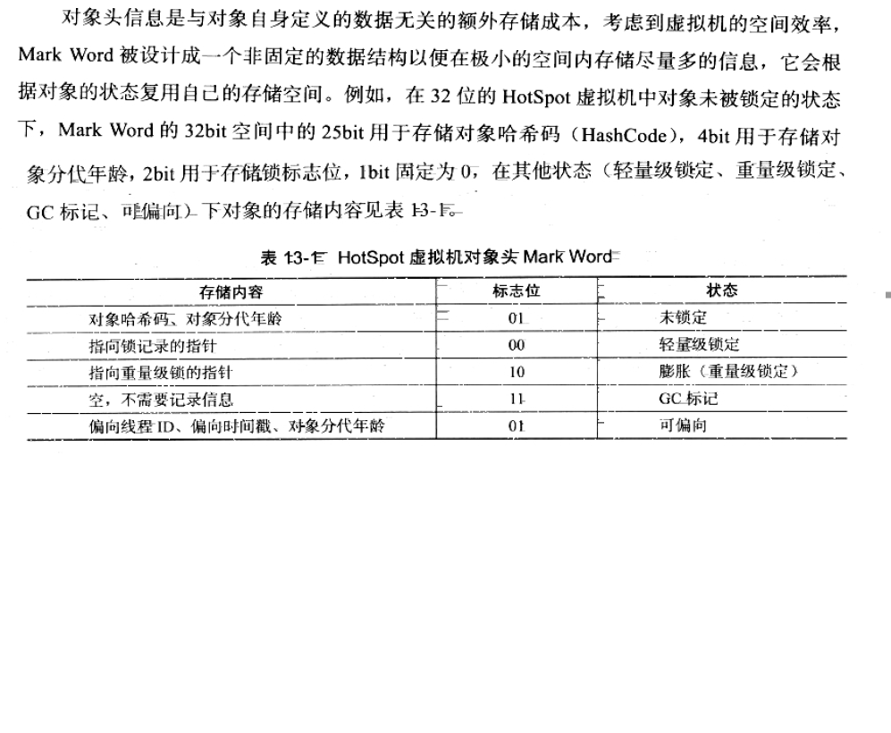
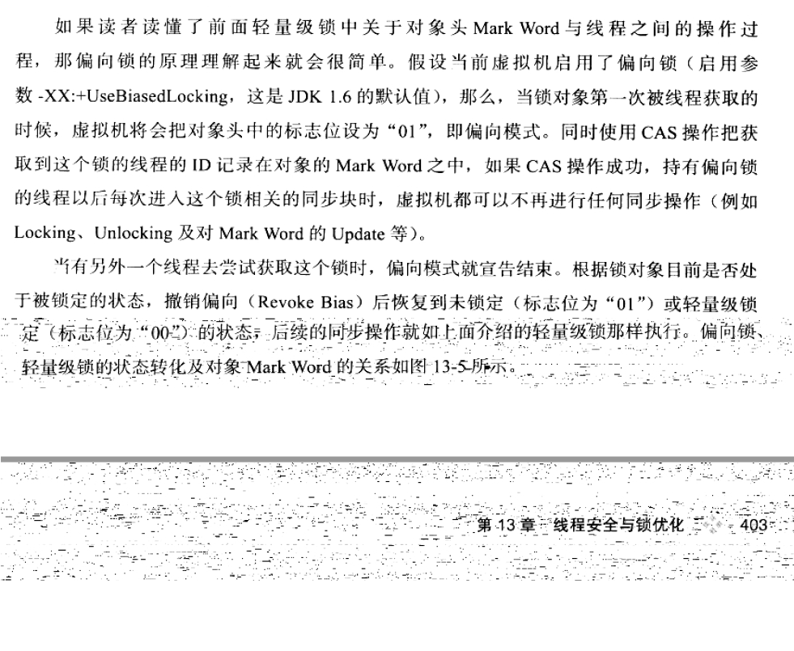
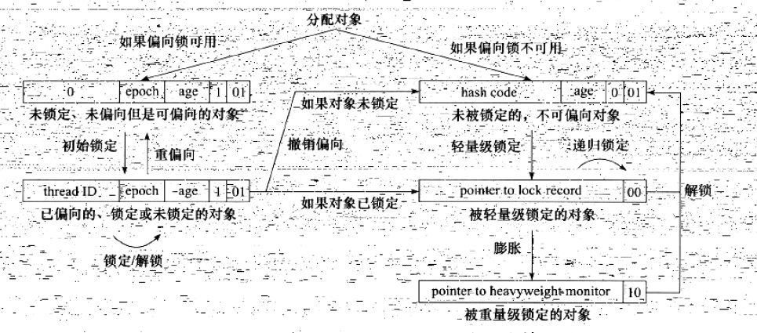

## 线程安全和锁优化
### 一、概述
### 二、线程安全
#### 2.1 Java中的线程安全
1. 不可变

   Java中如果对象时final修饰。如果是基本类型，它一定是不可变的。如果是引用类型，需要保证对象的行为不会对其产生影响。
   可以参考java.lang.String类，调用的substring()、replace()方法不会对其原来的对象值产生影响，而是新new出来一个值返回。

   保证对象的行为不影响自己的状态的方式有很多。简单方式：把对象中待变量的都声明成final.。如可以参考String,Integer类。
   但是AtomicInteger类不是原子，具体可以参见其源码实现。

2. 绝对线程安全

   1. Java中标注的线程安全的类，大部分都不是线程安全的类，即使被sync修饰，但是也不能保证其任何时候状态下都是线程安全的
   2. 例如Vector集合，多个线程进行操作。必须要在调用端做同步，否则还有可能发生错误。
3. 相对线程安全

   1. 就是通常意义上我们所讲的线程安全的概念。保证这个对象单独的操作是线程安全的。
   2. 例如Vector、HashTable等类都是线程安全的类

4. 线程兼容

   线程兼容指的线程对象本身并不是线程安全的，但是可以通过调用端正确的使用来保证在多线程环境下的正确性。
5. 线程独立

   指无论调用端是否采取了同步措施，都无法在多线程环境中并发使用代码。这类代码都是有害的，应当避免。
   例如Thread的suspend()和resume()方法（现在已被废弃）。
#### 2.2 线程安全的实现方法
1. 互斥同步

   synchronized 和 juc包下的ReentrantLock

2. 非阻塞同步

   CAS（注意ABA问题）
3. 无同步方案

   1. 可重入代码

   2. 线程本地存储
      ThreadLocal
### 三、锁优化
####  3.1 自旋锁和自适应自旋
1. 为了让线程等待，我们只需要让线程执行一个忙循环（自旋），这项技术就是所谓的自旋。
2. 自旋等待不能替代阻塞，且不说对处理器数量的要求，自旋等待本身虽然避免了线程切换的开销。但是它要占用处理器的时间
   因此，如果锁被占用的时间很短，自旋等待的效果就会非常好。反之，如果锁被占用的时间很长，自旋线程指挥白白占用
   cpu而造成性能的浪费。
3. JDK1.6后引入了自适应的自旋锁。
4. JDK1.7开始，自旋锁的参数被取消，虚拟机不再支持由用户配置自旋锁，自旋锁总是会执行，自旋锁次数也由虚拟机自动调整
####  3.2 锁消除
1. 指虚拟机即时编译器在运行时，对一些代码上要求同步，但是检测到不可能存在共享数据竞争的锁进行消除。
2. 锁消除的判定主要依靠逃逸技术的数据支持。
####  3.3 锁粗化
1. 原则上我们编写代码的时候，总是推荐将同步块的作用范围限制的尽量小。只有在共享数据的实际作用域中进行同步。这样使得
   同步的操作数量尽可能的小，如果锁存在竞争，那么等待锁的线程也能尽快的拿到锁
2. 大部分情况下，上面的原则都是正确的。但是如果一系列连续操作都是对同一对象反复的加锁和解锁，甚至加锁的操作是在
   循环体中，那么即使没有线程的竞争，频繁的互斥操作也会造成不必要的性能损耗。
####  3.4 轻量级锁
1. 轻量级锁是JDK1.6后加入的新型锁机制。
2. 所谓轻量是相对于使用操作系统互斥量来实现的传统锁而言的。因此传统的锁机制被称为“重量级”锁。
3. 轻量级锁不是用来替代重量级锁的，它的本意是在没有多线程竞争的前提下，减少使用传统重量级锁使用操作系统互斥量产生的性能消耗。
4. HotSpot虚拟机的对象头：一部分用于存储对象自身的运行时数据（哈希码、GC分代年龄、等）；
   一部分用于存储指向方法区对象类型的数据指针，如果是数组对象，还有一个数组长度
5. 存储的Mark Word说明：

   
6. 轻量级锁能提升程序同步性能的关键依据是：“对于绝大部分锁，在整个同步周期都是不存在竞争的”，这是一个经验数据。
   轻量级锁使用了CAS操作避免了互斥量的开销，但是如果存在锁竞争的情况下，除了互斥量的开销外，还将发生额外的CAS操作，
   因此在有竞争的情况下，轻量级锁会比传统的重量级锁更慢。
####  3.5 偏向锁
1. 偏向锁也是JDK1.6引入的一项锁优化技术。
2. 目的在于消除数据在无竞争环境下同步原语，进一步提高程序的性能。如果说轻量级锁在无竞争的环境下使用CAS操作去
   去消除同步使用的互斥量，那么偏向锁就是在无竞争的情况下把整个同步都消除掉，连CAS操作都不做。
3. 偏向锁会偏心于第一个获取它的线程，如果在接下来执行的过程中，该锁该锁没有被其他线程获取，则持有该偏向锁的
   线程将永远不需要再同步。
4. 过程举例

   
5. 偏向锁、轻量级锁、重量级锁之间的转换

   
6. 偏向锁可以提高带同步但是无竞争的程序性能。它是一个带有权益平衡的优化，比如说程序中的大多数锁都是多个线程访问的话，
   那么偏向模式则是多余的。

