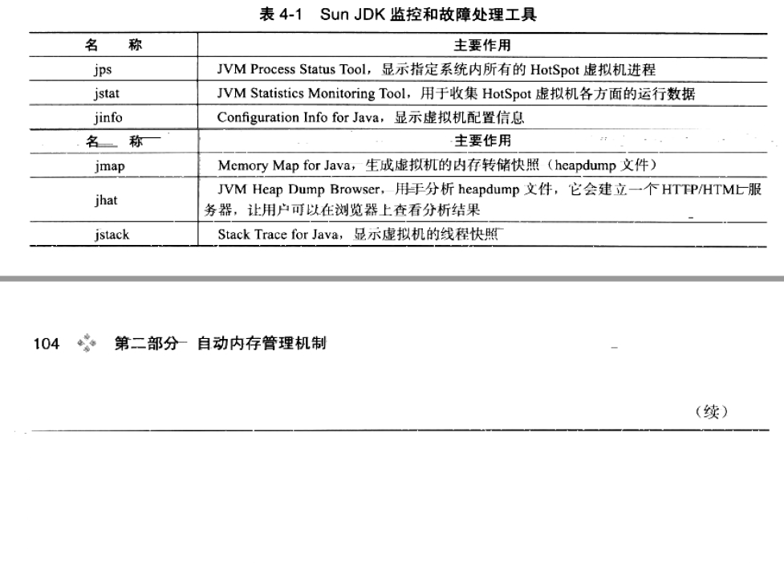
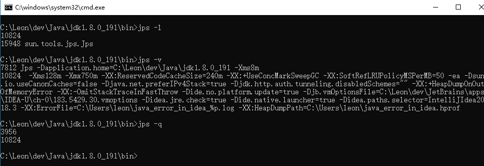
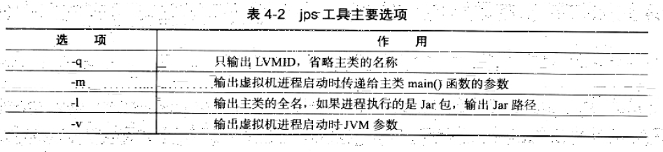
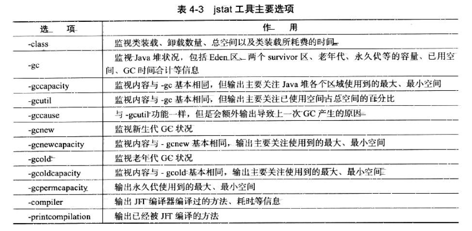
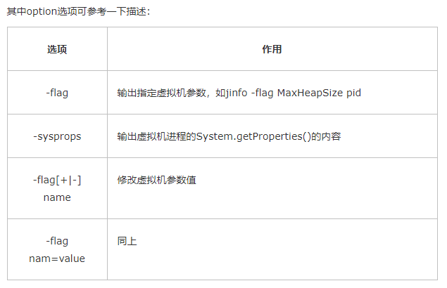
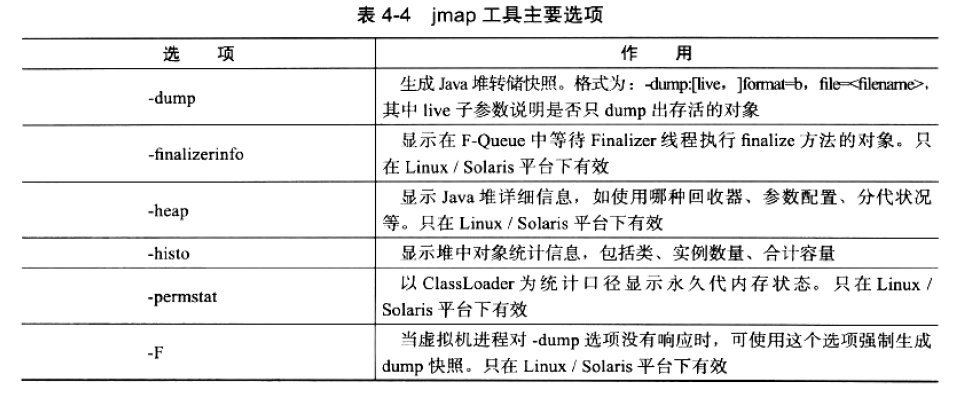
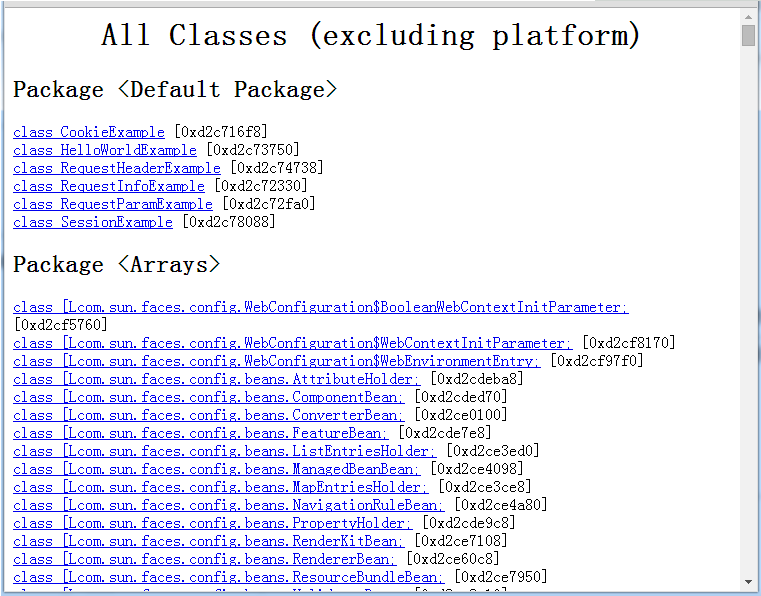
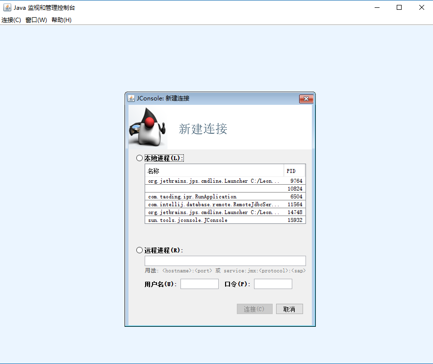
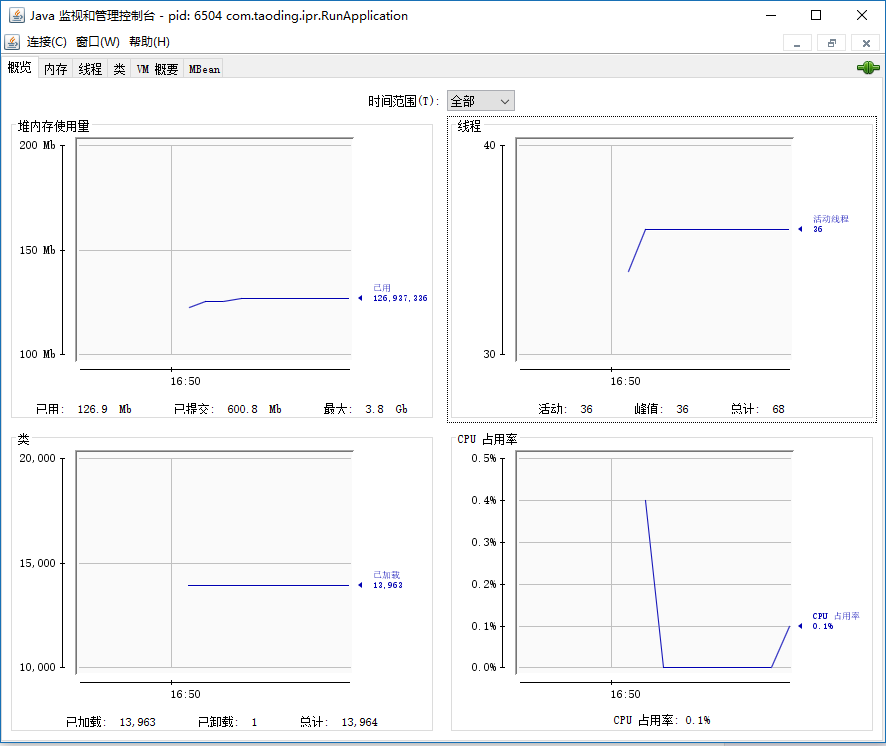

## 四、虚拟机性能监控和故障处理工具
Java和c++之间有一堵由内存动态分配和垃圾回收技术隔离的高墙。
### 4.1 概述
### 4.2 JDK的命令行工具
1. 1.5版本如果需要使用检测工具需要使用在启动时添加"-Dcom.sun.management.jmxremote"开启JMX功能，1.6之后此功能是默认开启的
2. 工具列表

   
#### 4.2.1 jps:虚拟机进程状况工具
1. Local Virtual Machine Identifier LVMID
2. jps命令格式
   jps [option] [hostid]
   
   示例如下：
   
   
3. 工具主要选项参数

   

#### 4.2.2 jstat:虚拟机统计信心检测工具
1. 作用：用于监视虚拟机运行状态信息的命令行工具。他可以显示本地或远程进程中类装载、内存、垃圾收集、JIT编译参数
   等。它是运行期定位虚拟机性能问题的首先工具。
2. jstat命令格式
   
   jstat [ option vmid[ internal[m|ms] [count] ] ]
3. vmid和lvmid的区别

   1) 如果是本地虚拟机的话，二者是一致的
   2) 如果是远程虚拟机的话，vmid则为：[protocol:] [//] lvmid [@hostname [:port]/servername]
4. 参数interval和count代表查询间隔和次数，如果省略这两个参数，说明只查询一次。
   假设需要每250毫秒查询一次进程ID为2764的垃圾收集状况，一共查询20次，那命令应当是：
   
   jstat –gc 2764 250 20
5. 选项option代表着用户希望查询的虚拟机信息，主要分为3类：类装载、垃圾收集、运行期编译状况，具体选项作用请参考以下表格描述:

   
6. 示例
   ```
   [root@WC01 bin 17:59 #35]$ jstat -gcutil 3850
   
     S0     S1     E      O      P     YGC     YGCT    FGC    FGCT     GCT  
   
     0.00  50.00  71.32  42.89  50.56    639    1.727     5    0.327    2.054
   ```
   
   S0、S1表示Survivor1、Survivor2，分别使用了0%和50%的空间；
   
   E表示Eden区，使用了71.32%的空间；
   
   O表示老年代Old区，使用了42.89%的空间；
   
   P表示永久代Pernament区，使用了50.56的空间；
   
   YGC表示执行Minor GC的次数，一共执行了639次；
   
   YGCT表示执行Minor GC的总耗时为1.727秒
   
   FGC表示执行Full GC的次数，一共执行了5次；
   
   FGCT表示执行Full GC的总耗时为0.327秒；
   
   GCT表示所有GC总耗时为2.054秒
#### 4.2.3 jinfo:Java配置信息工具
1. 作用：实时查看和调整虚拟机的各项参数。
2. jinfo命令格式：jinfo [option] pid
3. option选项参数

   
4. 示例
   
   ```
   [root@WC01 bin 18:21 #47]$ jinfo -flag MaxHeapSize 3850
   
   -XX:MaxHeapSize=492830720
   ```
#### 4.2.4 jmap：Java内存映像工具
1. jmap（Memory Map for Java）命令用于生成堆转储快照（一般称为heapdump或dump文件）。
   如果不使用jmap命令，要想获得Java堆转储快照，还有一些比较“暴力”的手段
2. 暴力手段包括：
   1) 通过-XX:+HeapDumpOnOutOfMemoryError参数，可以让虚拟机在OOM异常出现之后自动生成dump文件；
   j2) 通过-XX:HeapDumpOnCtrlBreak参数则可以使用[Ctrl]+[Break]键让虚拟机生成dump文件；
   3) 可在Linux系统下通过kill -3命令发送进程退出信号“吓唬”一下虚拟机，也能拿到dump文件
3. jmap命令格式：jmap [option] vmid
4. jmap的作用并不仅仅是为了获取dump文件，它还可以查询finalize执行队列、Java堆和永久代的详细信息，
   如果空间使用率、当前用的是哪种收集器等。请参考以下选项参数描述:
   
   
5. 示例
   ```
   [root@WC01 dumpfile 18:49 #66]$ jmap -dump:format=b,file=tomcat.bin 3850
   
   Dumping heap to /usr/local/apache-tomcat-6.0.43/logs/dumpfile/tomcat.bin ...
   
   Heap dump file created
   
   [root@WC01 dumpfile 18:49 #67]$ ls
   
   tomcat.bin
   
   [root@WC01 dumpfile 18:49 #68]$
   ```
#### 4.2.5 jhat:虚拟机堆转储快照分析工具
1. Sun JDK提供jhat（JVM Heap Analysis Tool）命令与jmap搭配使用，来分析jmap生成的堆转储快照。
   Jhat内置了一个微型的HTTP/HTML服务器。生产dump文件的分析结果后，可以在浏览器中查看
2. 示例
   ```
   [root@WC01 dumpfile 12:35 #9]$ jhat tomcat.bin
   
   Reading from tomcat.bin...
   
   Dump file created Wed Jul 20 18:49:38 CST 2016
   
   Snapshot read, resolving...
   
   Resolving 280853 objects...
   
   Chasing references, expect 56 dots........................................................
   
   Eliminating duplicate references........................................................
   
   Snapshot resolved.
   
   Started HTTP server on port 7000
   
   Server is ready.
   ```
   
   用户在浏览器中输入http://localhost:7000/就可以看到分析结果了，如下图所示：
   
   
   
3. 注意：如果有其它工具可以分析，否则不建议使用jhat。
   首先，一般不会直接在生产环境直接分析dump文件，因为分析dump文件是一件耗时耗资源的事情，
   条件允许的话首选图形分析工具（后面会介绍）；其次是jhat的分析功能过于简陋
#### 4.2.6 jstatck:Java堆栈跟踪工具
1. jstack（Stack Trace for Java）命令用于生产虚拟机当前时刻的线程快照
  （一般称为threaddump或者javacore文件）。线程快照就是当虚拟机内每一条线程正在执行的方法堆栈集合，
   生产线程快照的主要目的是定位线程出现长时间停顿的原因，如线程间死锁、死循环、请求外部资源导致
   长时间等待等都是导致线程长时间停顿的常见原因。线程出现停顿的时候通过jstack来查看各个线程的
   调用堆栈，就可以知道没有响应的线程到底在后台做些什么事情，或者等待着什么资源。
2. jstack命令格式：jstack [option] vmid
3. option选择的合法值域具有含有请看下表:
   
   
4. 示例
   
   ```
   [root@WC01 dumpfile 12:51 #13]$ jstack -l 3845
   2016-07-21 12:51:53
   Full thread dump Java HotSpot(TM) Server VM (20.45-b01 mixed mode):
   
   "Attach Listener" daemon prio=10 tid=0x0852b000 nid=0x1103 waiting on condition [0x00000000]
      java.lang.Thread.State: RUNNABLE
   
      Locked ownable synchronizers:
           - None
   ......
   ......
   ......
   "main" prio=10 tid=0x08058400 nid=0xf06 runnable [0xf6940000]
      java.lang.Thread.State: RUNNABLE
           at java.net.PlainSocketImpl.socketAccept(Native Method)
           at java.net.PlainSocketImpl.accept(PlainSocketImpl.java:408)
           - locked <0xea12b248> (a java.net.SocksSocketImpl)
           at java.net.ServerSocket.implAccept(ServerSocket.java:462)
           at java.net.ServerSocket.accept(ServerSocket.java:430)
           at org.apache.catalina.core.StandardServer.await(StandardServer.java:430)
           at org.apache.catalina.startup.Catalina.await(Catalina.java:676)
           at org.apache.catalina.startup.Catalina.start(Catalina.java:628)
           at sun.reflect.NativeMethodAccessorImpl.invoke0(Native Method)
           at sun.reflect.NativeMethodAccessorImpl.invoke(NativeMethodAccessorImpl.java:39)
           at sun.reflect.DelegatingMethodAccessorImpl.invoke(DelegatingMethodAccessorImpl.java:25)
           at java.lang.reflect.Method.invoke(Method.java:597)
           at org.apache.catalina.startup.Bootstrap.start(Bootstrap.java:289)
           at org.apache.catalina.startup.Bootstrap.main(Bootstrap.java:414)
   
      Locked ownable synchronizers:
           - None
   
   "VM Thread" prio=10 tid=0x080d4000 nid=0xf09 runnable 
   
   "GC task thread#0 (ParallelGC)" prio=10 tid=0x0805f400 nid=0xf07 runnable 
   
   "GC task thread#1 (ParallelGC)" prio=10 tid=0x08060c00 nid=0xf08 runnable 
   
   "VM Periodic Task Thread" prio=10 tid=0xd1978400 nid=0xf13 waiting on condition 
   
   JNI global references: 1089
   ```
#### 4.2.7 hsdis:jit生成代码反汇编
1. HSDIS是一个Sun官方推荐的HotSpot虚拟机JIT编译代码的反汇编插件。
   在这先插两句对JIT的简单描述，JIT是讲.class字节码翻译成本机的机器代码（就是0和1），
   至于为什么这么做，肯定是提高效率，更多JIT知识可自行学习。 而HSDIS就是把这些被JIT翻译过的机器码
   （0和1）反编译为汇编（面向IT人员的开发语言）。为什么要无端端把机器语言翻译会开发人员看得懂的汇编
   语言，是因为当我们需要检查程序性能的时候，希望更能接近计算机语言的本质去分析，由于汇编是直接面向
   硬件的，而机器语言我们又看不懂，所以最接近本质的还是汇编语言。当然，我们可以基于字节码（.class）
   层面上进行分析，但随着技术的发展，这些字节码指令的执行过程等细节与虚拟机规范所描述的相差越来越远，
   就是字节码的行为跟机器码的行为有可能差异很大。所以通过汇编语言分析可以更接近计算机语言的本质。
2. 这个HSDIS JIT反汇编插件包含在HotSpot虚拟机的源码之中，但没有提供编译后的程序。
   在Project Kenai的网站也可以下载到单独的源码。它的作用是让HotSpot的-XX:PrintAssembly
   指令调用它来把动态生成的本地代码还原为汇编代码输出，同时还生成了大量有价值的注释，
   这样我们就可以通过输出代码来分析问题。读者可以根据自己的操作系统和CPU类型从Project Kenai的
   网站上下载编译好的插件，直接放到JDK_HOME/jre/bin/client和JDK_HOME/jre/bin/server目录中即可。
   如果没有找到所需操作系统的成品，那就得自己使用源码编译一下。
### 4.3 JDK的可视化工具
JDK中除了提供大量的命令行工具外，还有两个功能强大的可视化工具：JConsole和VisualVM，这两个工具是JDK的正式成员。
#### 4.3.1 JConsole:Java监视和控制平台
1. JConsole（Java Monitoring and Management Console）是一种基于JMX的可视化监视、管理工具。
   它管理部分的功能是针对JMX Mbean进行管理。
   知识扩展：JMX（Java Management Extensions）即JavaMbean管理扩展，MBean（managed beans）
   即被管理的Beans。一个MBean是一个被管理的Java对象，有点类似于JavaBean，一个设备、一个应用或者
   任何资源都可以被表示为MBean，MBean会暴露一个接口对外，这个接口可以读取或者写入一些对象中的属性.
2. 启动JConsole
   
   通过JDK_HOME/bin目录下的“jconsole.exe”启动JConsole后，讲自动搜索出本机运行的所有虚拟机进程，
   不需要用户自己再用JPS来查询了。也可以使用下面的“远程进程”功能来连接远程服务器，
   对远程虚拟机进行监控，如下图所示：
   
   
   
   
   “概述”页签显示的是整个虚拟机主要运行数据的概览，其中包括“堆内存使用情况”、“线程”、“类”、“CPU使用情况”4种信息的曲线图，
   这些曲线图是后面“内存”、“线程”、“类”页签的信息汇总。具体的含义后面会详细介绍。
3. 内存等于于jstat；线程等同于jstack
#### 4.3.2 VisualVM:多合一故障处理工具
1. VisualVM（ALL-in-One Java Troubleshooting Tool）是到目前为止随JDK发布的功能最强大的运行监控和故障处理程序，并且可以预见在未来的
   一段时间内都是官方主力发展的虚拟机故障处理工具。并且其功能并不比JProfiler、YourKit收费的软件差。
   而且它还有有一个其他工具无法媲美的优点：对实际应用程序的性能应用很小，可以直接使用在生产环境中。
2. VisualVM的兼容范围和插件安装
   略
   


   
